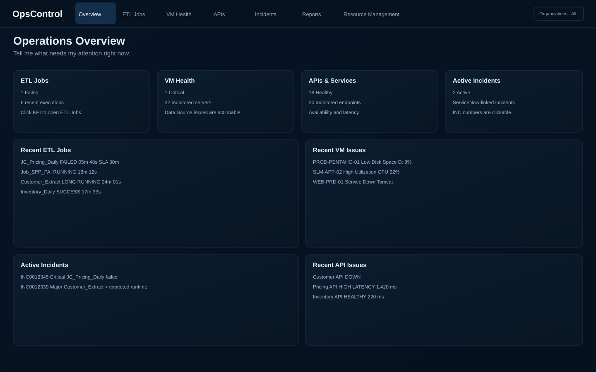
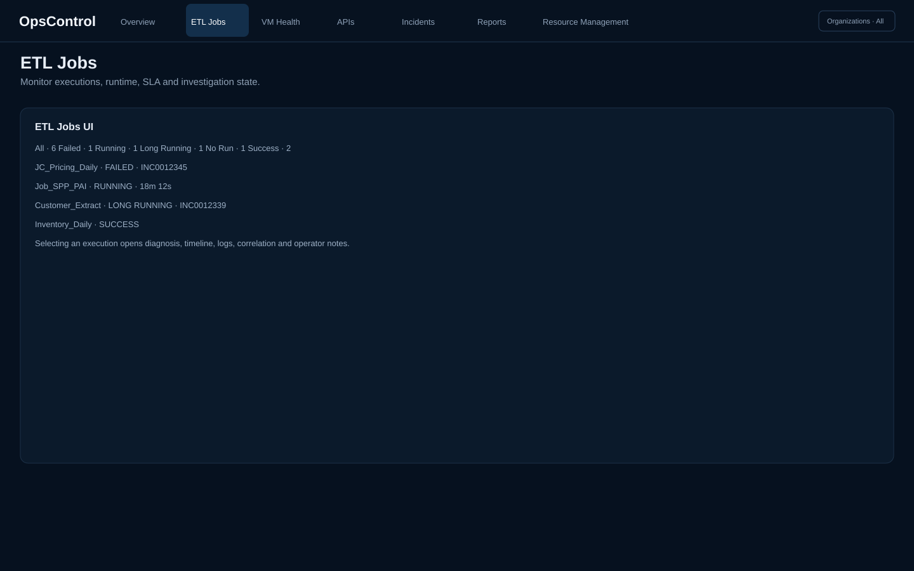
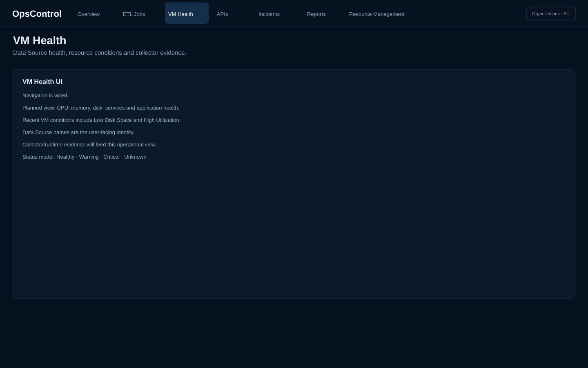
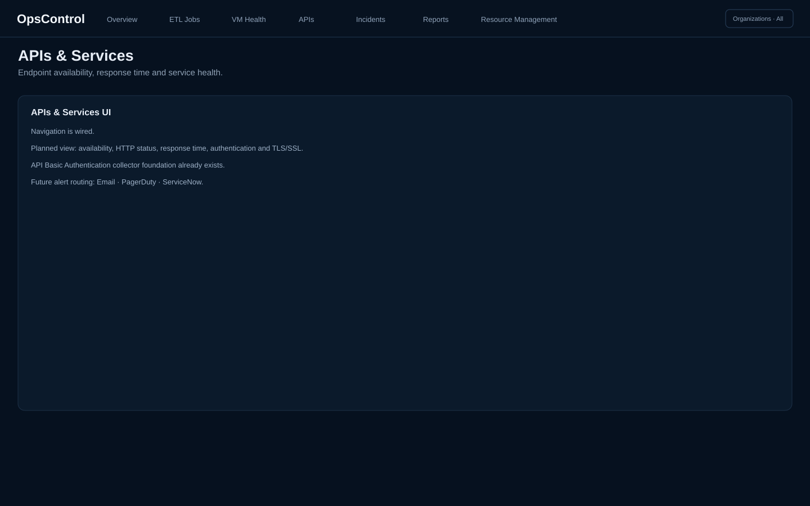
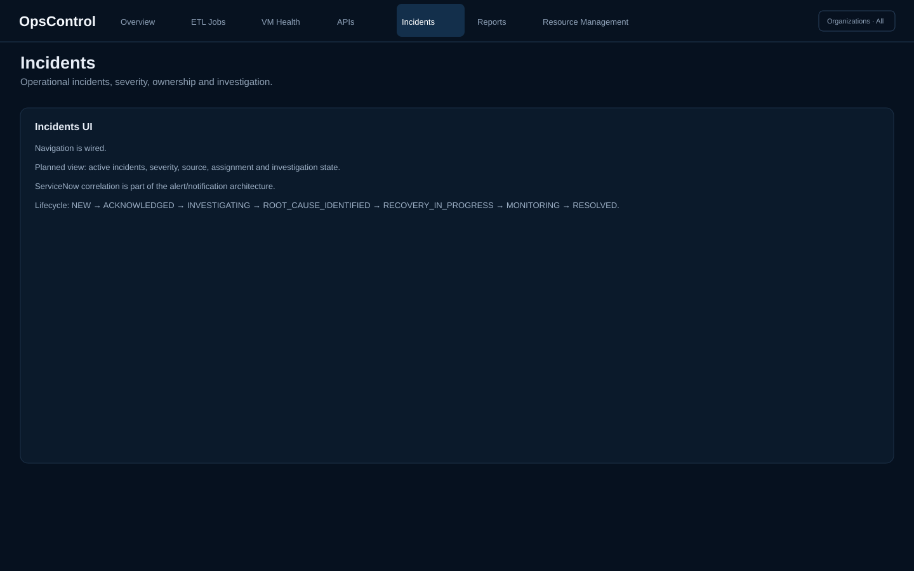
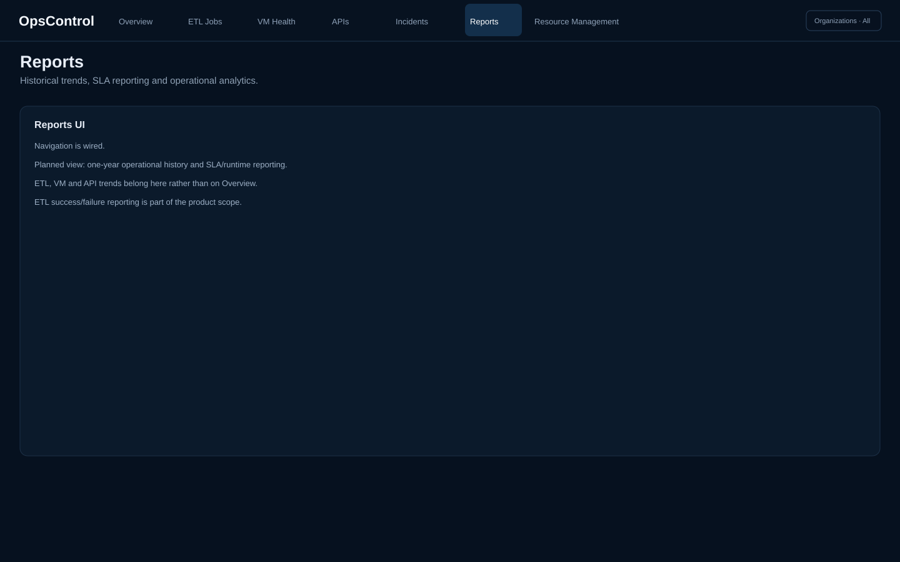
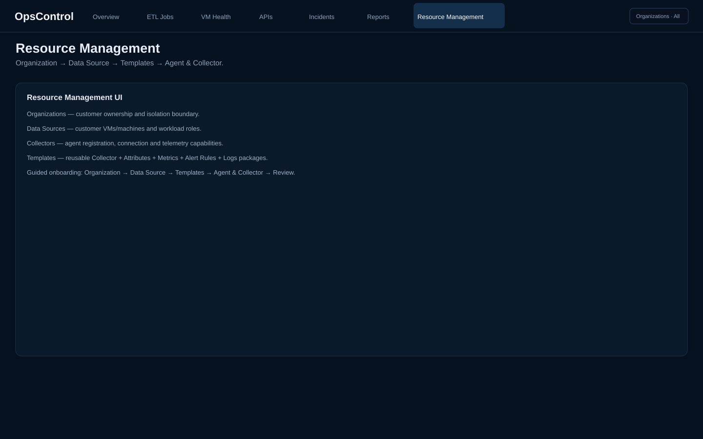

# OpsControl Dashboard

**Private-network HTTPS monitoring:** [Outbound Remote Agent Quickstart](docs/REMOTE_AGENT_QUICKSTART.md) — scoped workers, scheduled jobs, strict egress and deduplicated evidence (draft feature, not production approved).\n\n**New to OpsControl?** Start with the [Beginner Quickstart](docs/QUICKSTART.md) to learn the basic monitoring concepts and run the current technical preview locally. This is a general-purpose open-source monitoring and observability project in development, not a production-ready release. The guide documents current limitations and uses only local/synthetic examples.

OpsControl Dashboard is an enterprise operations monitoring platform being designed to give NOC, SLM, support, and engineering teams a single operational view of production ETL jobs, VMs, applications, APIs, incidents, alerts, and operational history.

> **Documentation principle:** This README is the living project knowledge base. Important architecture, requirements, operating rules, configuration decisions, implementation steps, and validated design decisions should be documented here as the project evolves.

---

## UI Tour — Frontend

The SVG images below are **illustrative UI diagrams**, not browser screenshots or proof of working functionality. They introduce the product direction and may differ from the current application.

> **Verified UI note (Phase 1 audit):** Playwright captures of the actual frontend are produced by [Phase 1 Staging Verification](https://github.com/Parikshit-Sahrawat/OpsControl_Dashboard/actions/workflows/phase1-staging.yml) and attached to workflow runs as downloadable screenshot artifacts. **Overview**, **ETL Jobs** and **Resource Management** have rendered page implementations; **VM Health**, **APIs & Services**, **Incidents** and **Reports** currently render placeholders. Resource Manager configuration is not evidence of an operational collector. See [the evidence-based Phase 1 audit](docs/sdlc/07-CODE-AUDIT.md) and [handoff](docs/sdlc/09-PHASE1-HANDOFF.md).

### 1. Operations Overview



**Purpose:** The Overview is the operator's starting point: **"What needs my attention right now?"**

Key features:
- Clickable ETL Jobs, VM Health, APIs & Services, and Active Incidents KPIs.
- Recent ETL executions with operational status.
- Recent VM issues using the Data Source name as the operator-facing identity.
- VM conditions such as **Low Disk Space** and **High Utilization**.
- Recent API issues and availability/latency signals.
- Active incident references designed to link to ServiceNow.
- Organization-scoped operational context.
- 5-second refresh contract.

### 2. ETL Jobs



**Purpose:** Monitor and investigate individual ETL executions.

Key features:
- `SUCCESS`, `FAILED`, `RUNNING`, `LONG_RUNNING`, and `NO_RUN` states.
- Scheduled vs Manual execution types.
- Expected runtime vs SLA monitoring.
- Status filters and search.
- Execution details drawer.
- Failure diagnosis, timeline, step-level execution and incident history.
- Investigation lifecycle and operator notes.
- Correlation with VM, application, metric and log evidence.

### 3. VM Health



**Purpose:** Provide a dedicated operational view for customer Data Sources and their infrastructure health.

Planned/next-stage capabilities:
- CPU, memory and disk monitoring.
- Service/process/application health.
- Data Source-level status and conditions.
- Collector/runtime evidence.
- Critical, Warning, Healthy and Unknown states.

### 4. APIs & Services



**Purpose:** Monitor application/API availability and performance.

Planned/next-stage capabilities:
- Availability and HTTP status.
- Response-time monitoring.
- Authentication checks.
- TLS/SSL checks.
- Alert routing through Email, PagerDuty and ServiceNow.

The backend already contains the first real API collector foundation using Basic Authentication.

### 5. Incidents



**Purpose:** Turn operational signals into actionable incident investigation.

Planned/next-stage capabilities:
- Active incident list.
- Severity and source.
- Assignment and investigation state.
- ServiceNow linkage.
- Investigation lifecycle from detection through resolution.

### 6. Reports



**Purpose:** Keep historical and analytical information out of the real-time Overview while still providing operational reporting.

Planned/next-stage capabilities:
- One-year operational history.
- ETL runtime and SLA reporting.
- VM/API health trends.
- ETL success/failure reports.
- Historical operational analysis.

### 7. Resource Management



**Purpose:** Define the monitoring control plane before runtime collection begins.

Current Resource Management model:

    Organization
        ↓
    Data Source
        ↓
    Monitoring Templates
        ↓
    Agent & Collector
        ↓
    Review

The Resource Management area contains:
- **Organizations** — customer ownership and isolation boundary.
- **Data Sources** — customer machines/VMs with environment, OS, workload roles, product and host-group metadata.
- **Collectors** — connection mode, endpoint, protocol, TLS, Vault secret reference, install method, version and telemetry capabilities.
- **Templates** — reusable monitoring packages containing Collector configuration, Attributes, Metrics, Alert Rules and Log Collection rules.
- Guided Data Source onboarding.
- Template versioning and normalized Data Source template attachments.
- Effective monitoring configuration resolution.

The next Phase 2 step is to reconcile that effective configuration into actual operational Collector, Metric Definition, Alert Rule and Log Source records.

---

## Current implementation status

**Phase:** Platform foundation + monitoring control plane

**Current focus:** Data Source, Collector Manager, Metric Definition, and Log Source control plane

**Repository:** `Parikshit-Sahrawat/OpsControl_Dashboard`

**Frontend:** Vite + React under `frontend/`

The ETL frontend is API-driven through FastAPI. The monitoring configuration control plane is now being built so resources, data sources, collectors, metrics, and log sources can be configured from OpsControl UI/API. No production Pentaho job control is exposed.

### ETL Jobs page now supports

- Current execution-focused monitoring
- `SUCCESS`, `FAILED`, `RUNNING`, `LONG_RUNNING`, and `NO_RUN` states
- No Run logic based on expected execution window + grace period
- Expected runtime vs SLA visual logic
- Environment filtering with PROD as the default operational scope
- Explicit Scheduled / Manual execution-type filtering
- Search by Job Order, Job Order ID, or server
- Status filter counts
- Loading, error, and empty states
- State-aware Job Details drawer for failed, running, successful, long-running, and no-run executions
- Execution timeline with source attribution
- Step-level execution with optional type/duration
- Related health information where available
- Same Job Order recent history
- Important operational alert/incident history
- Investigation lifecycle transitions
- Chronological Operator Notes
- Operator notes and investigation transitions are currently persisted in frontend state only
- 5-second refresh contract placeholder

### Monitoring rules

```text
Expected execution window + grace period
        |
        +-- execution detected -> normal execution monitoring
        |
        +-- no execution       -> NO_RUN

Execution runtime
        |
        +-- below expected runtime -> ON TRACK
        +-- expected runtime passed -> LONG_RUNNING / AT RISK
        +-- SLA passed             -> SLA BREACH
```

Expected runtime and SLA remain separate thresholds. The UI does not execute, retry, stop, or restart production workloads.

---

# 1. Project Goals

OpsControl is intended to answer:

> **"What needs my attention right now?"**

The platform should help operators:

- See current production health quickly.
- Detect failed, long-running, and missing ETL executions.
- Investigate Pentaho failures without jumping between multiple tools.
- Correlate ETL failures with VM, application, database, API, and dependency health.
- Track incidents and operator investigation history.
- Monitor VM resources, services, processes, and applications.
- Monitor APIs, response time, availability, authentication, SSL, and certificates.
- Generate operational reports and ETL success/failure reports.
- Integrate with Email, PagerDuty, and ServiceNow.
- Maintain one year of history initially.
- Provide Resource Management and role-based access for multiple departments/teams.

---

# 2. Current Product Scope

### Top navigation

1. Overview
2. ETL Jobs
3. VM Health
4. APIs
5. Incidents
6. Reports
7. Resource Management

### Home / Overview

The Overview page is intentionally action-oriented.

It should show:

- ETL Jobs KPI
- VM Health KPI
- APIs & Services KPI
- Active Incidents KPI
- Recent ETL Jobs
- Recent VM Issues
- Recent API Issues
- Active Incidents

It should **not** become a historical analytics page.

Excluded from Overview:

- Long-term trends
- Historical graphs
- System Health/integration-status panel
- SFTP/S3 section
- Settings/configuration
- Resolved historical ETL noise

Historical analysis belongs in **Reports**.

### Refresh

- Target operational refresh: **5 seconds**
- UI should clearly indicate automatic refresh state.

### Status colors

- Green = Healthy / Success
- Yellow = Warning / Long Running / At Risk
- Red = Critical / Failed
- Blue = Running
- Gray = Unknown / Not Started

---

# 3. Resource Hierarchy

The formal resource hierarchy is:

```
Organization / Customer
        |
        +-- VM / Server
        |     |
        |     +-- Applications
        |     |     +-- Apache
        |     |     +-- Tomcat
        |     |     +-- IEngine
        |     |     +-- Pentaho
        |     |
        |     +-- ETL Job Orders
        |            |
        |            +-- Job Order Name
        |            |      +-- Schedule
        |            |      +-- SLA
        |            |      +-- Monitoring rules
        |            |
        |            +-- Job Order History
        |                   +-- Execution 001
        |                   +-- Execution 002
        |                   +-- Execution 003
        |
        +-- Other VMs...
```

### Organization / Customer

A Customer represents an organization.

### VM / Server

A VM represents an individual machine used to run applications and workloads.

### Application

Applications/services/processes running on a VM can be monitored independently.

**VM restart actions are intentionally excluded from OpsControl.**

---

# 4. ETL Monitoring Scope

Regular automated ETL monitoring is currently focused on **PROD only**.

QA/Test/non-production environments are not part of the regular monitoring scope. The current frontend can display other configured environments for validation, but it explicitly identifies them as outside the regular automated scope.

Each monitored ETL workload is a **Job Order**.

---

# 5. Job Order vs Job Order History

This distinction is fundamental to the backend design.

## Job Order

A Job Order represents:

> **What should run?**

A Job Order is identified by:

```
Organization + VM + Job Order Name
```

Internally it has a unique `job_order_id`.

## Job Order History

A Job Order History represents:

> **What actually happened during one execution?**

Every execution gets its own history record.

Scheduled and manual Pentaho executions are both captured.

Execution type:

- `SCHEDULED`
- `MANUAL`

---

# 6. ETL Scheduling

Both simple and advanced scheduling are required.

Simple schedules:

- Hourly
- Daily
- Weekly
- Monthly
- Quarterly

Advanced schedules:

- Every N hours
- Monday-Friday
- Specific days of month
- Multiple days/times
- Last working day
- First Monday of month
- Multiple execution windows
- Other future scheduling rules

Do not hard-code the database around only five frequency strings.

### Schedule vs expected execution

**Schedule** answers when the workload should run.

**Expected execution window** answers when OpsControl should expect an execution.

Example:

```
Schedule:
Daily at 08:00

Expected window:
08:00-08:15

No-run grace:
15 minutes
```

Only after the configured grace period should the monitor classify the execution as `NO_RUN`.

---

# 7. Runtime and SLA

Expected runtime and SLA are separate.

Example:

```
Expected runtime: 20 minutes
SLA:              30 minutes
```

Operational states:

```
08:00  Job starts
08:20  Expected runtime exceeded
       -> LONG_RUNNING / At Risk

08:30  SLA exceeded
       -> SLA BREACH
```

The frontend now visualizes this distinction directly in the ETL Jobs table and Job Details drawer.

---

# 8. ETL Job States

Initial normalized states:

- `SUCCESS`
- `FAILED`
- `RUNNING`
- `LONG_RUNNING`
- `NO_RUN`
- `NO_RESPONSE`

Additional UI-level step states:

- `SUCCESS`
- `FAILED`
- `RUNNING`
- `NOT_STARTED`
- `SKIPPED`
- `UNKNOWN`

---

# 9. Job Details Drawer

The Job Details drawer is the operational contract for the future backend API and database.

It is now state-aware:

- Successful execution
- Running execution
- Failed execution
- Long-running execution
- No-run condition

### Current drawer sections

1. Execution Summary
2. Failure Diagnosis, where applicable
3. Monitoring Diagnosis for No Run / Long Running
4. Execution Timeline
5. Step-level Execution
6. Related Health
7. Alert & Incident History
8. Recent History — same Job Order only
9. Investigation
10. Operator Notes

The drawer does not expose:

- Retry Job
- Start Job
- Stop/Cancel Job
- Restart VM
- Production Pentaho configuration changes

---

# 10. Investigation Lifecycle

Confirmed lifecycle:

```
NEW
  |
  v
ACKNOWLEDGED
  |
  v
INVESTIGATING
  |
  v
ROOT_CAUSE_IDENTIFIED
  |
  v
RECOVERY_IN_PROGRESS
  |
  v
MONITORING
  |
  v
RESOLVED
```

The React drawer now allows the operator to advance an investigable execution through this lifecycle.

Each transition records:

- Previous state
- New state
- Operator
- Timestamp
- Optional comment/reason in the future API contract

Execution status and investigation status remain separate.

A successful subsequent execution does not automatically resolve an investigation.

---

# 11. Operator Notes

The initial design uses simple chronological notes.

Each note contains:

- Note ID in the future backend
- Investigation ID in the future backend
- Operator
- Timestamp
- Note text
- Optional evidence/reference

The React prototype now provides a working **Add Note** interaction.

Current limitation:

> Notes are stored only in frontend state. Backend persistence will be implemented after the API contract is frozen.

Adding a note does not automatically change investigation status.

---

# 12. Execution Timeline

The Job Details drawer now supports structured timeline events.

Example:

```
08:00:01  Job started             Pentaho
08:01:12  Extract started         Pentaho
08:04:21  Transformation started  Pentaho
08:05:48  Database error          Pentaho
08:05:49  Job failed              Pentaho
08:05:55  Failure detected        OpsControl
08:06:01  PagerDuty triggered     PagerDuty
08:06:05  ServiceNow created      ServiceNow
```

The future backend should normalize source events while preserving their source attribution.

---

# 13. Step-level Execution

The drawer supports step-level states and optional metadata.

Potential fields:

- Step name
- Step type
- Step status
- Start time
- End time
- Duration
- Records read
- Records written
- Records rejected
- Error code
- Error message
- Step-specific log information

Fields remain optional when the Pentaho source cannot provide them.

---

# 14. Loading, Error, and Empty States

The ETL Jobs page now explicitly handles:

### Loading

Shows an operational loading state while execution data is being refreshed.

### Error

Shows an actionable error state with a Retry action.

### Empty

Shows a clear no-results state when filters/search return no executions, with a Clear Filters action.

These states are part of the frontend/API contract and should remain present when mock data is replaced by FastAPI.

---

# 15. Environment Handling

The ETL Jobs page now has a dynamic environment selector.

Current behavior:

- Defaults to `PROD`
- Detects configured environments from execution data
- Supports `All`
- Supports explicit environment filtering
- Shows a scope warning for non-PROD environments

Regular automated monitoring remains PROD-only.

This allows the UI to be ready for future multi-environment configuration without silently implying that QA/Test monitoring is already production scope.

---

# 16. Execution Type Filtering

The ETL Jobs page now supports:

- All
- Scheduled
- Manual

Execution type is displayed for every execution.

This is important because a manual execution is not automatically considered a recovery.

---

# 17. Alerts and Integrations

Initial alerting channels:

- Email
- PagerDuty

Incident integration:

- ServiceNow

The Job Details drawer shows important operational milestones rather than complete integration audit logs.

---

# 18. SFTP / S3 Monitoring

SFTP/S3 monitoring is not displayed on the Overview page.

Where implemented, checks should focus on:

- Expected file
- Expected arrival time
- Actual arrival time
- File size
- File age

Content validation is currently excluded.

---

# 19. API Monitoring

API monitoring requirements include:

- HTTP status
- Response time
- Availability
- Response body
- Authentication
- SSL
- Certificate expiry
- Request/response logging

---

# 20. VM Monitoring

VM monitoring should include:

- Availability
- CPU
- RAM
- Disk by drive
- Services
- Processes
- Applications
- Event/log information where useful

---

# 21. Reports

Reports are separate from the action-first Overview page.

Initial retention target: **1 year**.

ETL reports:

- Job success/failure trends
- SLA compliance
- Runtime trends
- Failure analysis
- Execution history
- Recurring failures
- Long-running jobs
- No-run events

---

# 22. Resource Management

Resource Management will eventually provide controlled configuration for:

- Organizations/customers
- VMs
- Applications
- Pentaho instances
- Job Orders
- Schedules
- Monitoring rules
- Alert policies
- API resources
- Dependencies
- Access permissions
- Roles
- Integration configuration

---

# 23. Roles and Permissions

Potential roles:

- Admin
- Operator
- Viewer
- Support
- Manager

RBAC is planned.

---

# 24. OpsControl-Native Architecture

OpsControl is intentionally replacing the Prometheus + Grafana dependency with its own monitoring platform.

```
                         OPSCONTROL UI
                              |
              +---------------+----------------+
              |                                |
        Configuration                    Visualization
              |                                |
              v                                v
      +----------------+              +-----------------+
      | Control Plane  |              | Dashboards      |
      | Resources      |              | Metrics         |
      | Data Sources   |              | Logs            |
      | Collectors     |              | Events          |
      | Metric Rules   |              | Incidents       |
      | Log Sources   |              | Reports         |
      +-------+--------+              +--------^--------+
              |                                |
              v                                |
       +----------------------------------------+
       |          COLLECTION PLANE              |
       | Collector Manager / Scheduler          |
       | VM | API | ETL | Log | SFTP | S3       |
       +-------------------+--------------------+
                           |
                           v
       +----------------------------------------+
       |          PROCESSING PLANE              |
       | Metric Processor | Log Processor       |
       | Event Processor  | Alert Engine        |
       | Correlation Engine                    |
       +-------------------+--------------------+
                           |
                    +------+------+
                    |             |
                    v             v
              Metrics Store    Log Store
                    |             |
                    +------+------+
                           |
                      Query Engine
                           |
                           v
                       OpsControl
```

PostgreSQL remains the system of record for configuration and operational records. The native metrics/log storage and query layers will be designed specifically for OpsControl rather than reproducing every feature of external observability products.

---

# 25. Security and Operational Safety

Initial safety principles:

- No production job execution control from OpsControl.
- No VM restart action.
- No direct production configuration changes from the monitoring drawer.
- Managed secrets rather than hard-coded credentials.
- RBAC before sensitive configuration/actions.
- Operator actions and investigation transitions must be auditable.
- Monitoring platform health must itself be monitored.

---

# 26. React Frontend Structure

```
frontend/
├── index.html
├── package.json
├── vite.config.js
└── src/
    ├── main.jsx
    ├── App.jsx
    ├── styles.css
    ├── data/
    │   └── mockData.js
    ├── components/
    │   ├── KpiCard.jsx
    │   ├── JobDetailsDrawer.jsx
    │   ├── StatusBadge.jsx
    │   └── TopNav.jsx
    └── pages/
        ├── Overview.jsx
        └── ETLJobs.jsx
```

The frontend has moved to the FastAPI contract for ETL execution data. Monitoring configuration UI will be added on top of the new configuration APIs.

---

# 27. Development Workflow

1. Validate operational requirement with human/operator feedback.
2. Freeze UX/data requirements for that capability.
3. Update README.
4. Update React frontend.
5. Define API contracts.
6. Define PostgreSQL schema.
7. Implement backend.
8. Connect real monitoring sources.
9. Test failure scenarios.
10. Document operational procedure.

**Do not design production database tables solely from assumptions.**

---

# 28. Current Decision Log

| Decision | Status |
|---|---|
| Top navigation | Confirmed |
| Action-first Overview | Confirmed |
| Overview refresh | 5 seconds |
| Historical trends on Overview | Excluded |
| SFTP/S3 on Overview | Excluded |
| PROD-only regular ETL monitoring | Confirmed |
| Organization → VM → Application/ETL hierarchy | Confirmed |
| Job Order vs Job Order History | Confirmed |
| Scheduled + manual executions | Confirmed |
| Simple + advanced schedules | Confirmed |
| Expected execution window/grace | Confirmed |
| Expected runtime separate from SLA | Confirmed |
| No Run detection | Confirmed in frontend contract |
| Environment filtering | Confirmed |
| Execution-type filtering | Confirmed |
| Full step-level Pentaho data where available | Confirmed |
| Execution timeline | Confirmed |
| Loading/error/empty states | Confirmed |
| Investigation lifecycle | Confirmed |
| Operator Notes | Simple chronological notes — Confirmed |
| Recent History | Same Job Order only — Confirmed |
| Alert & Incident History | Important operational events only — Confirmed |
| Retry/Start/Stop Pentaho job | Excluded |
| VM restart | Excluded |
| Recovery outside OpsControl | Confirmed |
| Email | Confirmed |
| PagerDuty | Confirmed |
| ServiceNow | Confirmed |
| 1-year initial history | Confirmed |
| Reports emailed | Confirmed |
| Resource Management | Confirmed |
| RBAC | Planned |
| Production backend schema | Not yet frozen |

---

# 29. Next Implementation Stage

The ETL Jobs frontend contract is now sufficiently mature to move toward:

1. FastAPI REST contract
2. PostgreSQL Job Order / Job Order History schema
3. Investigation and Operator Note API
4. ETL execution collector contract
5. Pentaho integration strategy
6. Real 5-second polling/refresh behavior
7. Alert and incident integration adapters
8. Authentication/RBAC

The next backend design should preserve the frontend distinctions already established:

- Job Order vs Job Order History
- Scheduled vs Manual
- Expected runtime vs SLA
- Schedule vs expected execution window
- Execution status vs investigation status
- Pentaho source facts vs OpsControl analysis
- Suspected cause vs confirmed root cause
- Same Job Order history vs broader correlation
- Operational incident milestones vs technical integration audit logs

---

## Project status

**Phase:** UX + operational requirements / POC

**Current focus:** Dynamic monitoring configuration foundation

**Source of truth:** GitHub repository + this README

**Frontend:** Vite + React application under `frontend/`

**Current frontend stage:** ETL Jobs UX connected to FastAPI; monitoring configuration API foundation implemented

**Repository:** `Parikshit-Sahrawat/OpsControl_Dashboard`


---

# 30. Backend Foundation

The project now has a FastAPI backend foundation under backend/.

Structure:

backend/
- app/main.py
- app/core/config.py
- app/db/session.py
- app/models/entities.py
- app/schemas/etl.py
- app/schemas/investigation.py
- app/api/health.py
- app/api/etl.py
- app/api/investigations.py
- migrations/
- requirements.txt
- .env.example

PostgreSQL is the system of record for operational history. SQLAlchemy 2.x is used for persistence and Alembic manages schema migrations.

Local PostgreSQL can be started with the repository docker-compose.yml.

Typical local flow:

1. Start PostgreSQL.
2. Create backend/.env from backend/.env.example.
3. Install backend/requirements.txt.
4. From backend/, run alembic upgrade head.
5. Run python scripts/seed_demo.py for development data.
6. Start FastAPI with uvicorn app.main:app --reload.
7. Open /docs to inspect the OpenAPI contract.

The demo seed is explicitly development data. It does not connect to Pentaho.

---

# 31. REST API Contract

Initial API namespace: /api/v1

Health:
- GET /health
- GET /health/db

ETL:
- GET /api/v1/etl/executions
- GET /api/v1/etl/executions/{execution_id}
- POST /api/v1/etl/job-orders/{job_order_id}/executions

ETL list filters:
- status
- environment
- execution_type
- search
- limit

Execution creation accepts:
- execution_type
- status
- start/end/detected timestamps
- expected runtime
- SLA
- SLA status
- failed step
- source error code/message/exception
- source log location
- source result
- incident reference
- optional step executions

Investigation:
- GET /api/v1/etl/executions/{history_id}/investigation
- POST /api/v1/etl/executions/{history_id}/investigation/transitions
- POST /api/v1/etl/executions/{history_id}/investigation/notes

Investigation transitions are server-side validated against the confirmed lifecycle. Invalid transitions return HTTP 409.

Operator notes are chronological operational records. Adding a note does not change investigation state.

The API intentionally does not provide Pentaho start/retry/stop or VM restart endpoints.

---

# 32. PostgreSQL Schema

Initial normalized schema:

organizations
  -> vms
      -> applications
      -> pentaho_instances
      -> job_orders
          -> job_order_histories
              -> job_step_executions
              -> investigations
                  -> investigation_transitions
                  -> operator_notes
              -> alert_incident_events

Important constraints:

- Job Order identity is unique on Organization + VM + Job Order Name.
- Job Order History is one execution record.
- Investigation is one-to-one with an execution history.
- Investigation transitions are append-only records.
- Operator Notes are append-only operational records.
- Source Pentaho facts are stored separately from OpsControl investigation analysis.
- UUIDs are used for internal identifiers.
- Advanced schedule configuration is stored as structured JSON so the schema is not limited to five frequency types.
- Expected runtime, SLA, expected window and no-run grace are separate fields.

The first Alembic migration is:

backend/migrations/versions/0001_initial.py

---

# 33. React → FastAPI Integration

The React application is now API-driven for ETL execution data.

frontend/src/api.js provides:
- execution list retrieval
- execution detail retrieval
- investigation retrieval
- investigation transition
- operator note creation

The previous mock execution dataset is no longer the runtime data source for App.jsx.

The frontend requests PROD executions from FastAPI and refreshes every 5 seconds.

VITE_API_BASE_URL controls the backend URL. See frontend/.env.example.

The existing loading, error and empty UI states remain part of the contract.

The current detail adapter intentionally keeps unsupported source data as empty/unknown rather than fabricating it. Rich timeline, alert history and same-Job-Order history will become backend-backed capabilities as their source tables and collectors are implemented.

---

# 34. Pentaho Collector Design

The next integration layer is documented in docs/PENTAHO_COLLECTOR.md.

The collector is explicitly read-only.

It converts Pentaho source evidence into the Job Order History contract and must not control production jobs.

Core principles:

- source execution identity must be idempotent
- source facts must be preserved
- OpsControl analysis must remain separate
- NO_RUN, LONG_RUNNING and SLA interpretation belong to OpsControl monitoring logic
- source transport failure is not the same as ETL FAILED
- credentials use managed secrets
- collector runs independently from the FastAPI process

The first adapter interface is provider-neutral and includes discovery, execution listing, execution detail, step retrieval and source error retrieval.

---

# 35. Current Implementation Stage

The project has moved from UX-only POC toward a working application foundation:

1. React operational UX
2. FastAPI backend
3. PostgreSQL schema
4. SQLAlchemy models
5. Alembic migration
6. ETL execution REST endpoints
7. Investigation lifecycle API
8. Operator Notes API
9. React API integration
10. Development seed data
11. Pentaho collector architecture

Next implementation work should focus on validating the backend locally, then implementing the real read-only Pentaho adapter and monitoring engine before adding additional integrations.


---

# 36. Dynamic Monitoring Configuration Foundation

OpsControl is being designed as a control plane where monitoring is configured from the UI rather than hard-coded into collectors.

The first configuration model consists of four core objects:

```
Organization
    |
    +-- Data Source
    |      |
    |      +-- Collector
    |      +-- Metric Definitions
    |      +-- Log Sources
    |
    +-- Resources
           |
           +-- VM
           +-- Application
           +-- ETL Job Order
           +-- API
```

## Data Source

A Data Source describes where monitoring data comes from.

Examples:

- Windows server
- Linux server
- API
- Pentaho
- SFTP
- S3
- Database
- File/log source

The current model supports:

- Source type
- Endpoint
- Authentication type
- Connection configuration
- Enabled/disabled state
- Source health/status
- Last test timestamp
- Last error

Connection credentials are configuration data and must be moved to managed secret storage before production use.

## Collector Manager

A Collector belongs to a Data Source and describes how OpsControl collects information.

Current model supports:

- Collector name
- Collector type
- Enabled state
- Collection interval
- Collector configuration
- Runtime status
- Last run
- Last successful run
- Last error
- Next run

The Collector Manager will later schedule and execute these definitions independently of the FastAPI request process.

## Metric Definition

A Metric Definition describes a metric that OpsControl should collect and expose.

Current model supports:

- Metric name
- Description
- Resource type
- Resource ID
- Metric type
- Unit
- Collection interval
- Retention
- Aggregation
- Query/collection configuration
- Data Source
- Collector
- Enabled state

Metric definitions are configuration. Actual metric samples are now stored by the native metrics subsystem.

## Log Source

A Log Source describes a stream/file/event source that OpsControl should collect.

Current model supports:

- Log source name
- Source type
- Resource type
- Resource ID
- Location/path/query
- Parser type
- Parser configuration
- Start position
- Collection interval
- Retention
- Data Source
- Collector
- Enabled state

Actual log events will be stored by the native log subsystem in a later phase.

---

# 37. Monitoring Configuration API

Namespace:

`/api/v1/monitoring`

### Data Sources

- GET `/data-sources`
- GET `/data-sources/{id}`
- POST `/data-sources`
- PATCH `/data-sources/{id}`
- DELETE `/data-sources/{id}`

DELETE is implemented as a disable operation.

### Collectors

- GET `/collectors`
- GET `/collectors/{id}`
- POST `/collectors`
- PATCH `/collectors/{id}`
- DELETE `/collectors/{id}`

DELETE disables the collector and marks it STOPPED.

### Metric Definitions

- GET `/metrics`
- GET `/metrics/{id}`
- POST `/metrics`
- PATCH `/metrics/{id}`
- DELETE `/metrics/{id}`

DELETE disables the metric definition.

### Log Sources

- GET `/logs`
- GET `/logs/{id}`
- POST `/logs`
- PATCH `/logs/{id}`
- DELETE `/logs/{id}`

DELETE disables the log source.

Filtering is available by organization, resource, source, enabled state, or collector where appropriate.

---

# 38. Monitoring Configuration Database

Alembic migration:

`backend/migrations/versions/0002_monitoring_configuration.py`

New tables:

```
organizations
    |
    +-- data_sources
           |
           +-- collectors
           |
           +-- metric_definitions
           |
           +-- log_sources
```

The model intentionally uses structured JSON for connector-specific configuration so new source types do not require a database migration for every new connector option.

Resource association uses:

- `resource_type`
- `resource_id`

This allows the same metric/log architecture to work with VMs, applications, APIs, ETL jobs, and future resource types.

---

# 39. Next Monitoring Implementation

The implementation has progressed through native metric sample storage and the metric query API.

Current next stages are:

1. Native log event storage.
2. Alert Rule evaluation against real metric samples.
3. Native alert state and notification orchestration.
4. Native charts and dashboards.
5. Windows Agent/WinRM transport.
6. Linux Agent/SSH transport.
7. Pentaho read-only provider adapter.

**Prometheus and Grafana are not part of the target architecture.**


---

# 40. Confirmed Monitoring Configuration UX Decisions

The following decisions are now locked into the implementation.

## Global Organization Context

Organization/customer selection is a **global OpsControl context**, not a Resource Management-only setting.

The selected organization appears in the top navigation and is persisted locally in the browser.

Organization context will scope:

- Overview
- ETL Jobs
- VM Health
- APIs
- Incidents
- Reports
- Resource Management
- future dashboards
- future metrics
- future logs
- future alerts

This is the foundation for multi-customer operation and future RBAC.

## Dynamic Collector Builder

Operators no longer need to write generic collector JSON.

The Collector Manager selects a collector type and renders a type-specific configuration form.

Initial collector builders:

### WINDOWS
- Hostname
- Agent or WinRM method
- Managed credential reference
- CPU
- Memory
- Disk
- Services
- Processes
- Event Logs

### LINUX
- Hostname
- Agent or SSH method
- Managed credential reference
- CPU
- Memory
- Disk
- Processes
- System Logs

### API
- URL
- HTTP method
- Authentication
- Timeout
- Expected status
- SSL verification
- Response time
- Response body

### PENTAHO
- Endpoint
- Managed credential reference
- Read-only collection boundary

The UI produces structured collector configuration for the runtime. Secrets must eventually be represented by managed secret references.

## Visual Metric Builder

Metric definitions now use a visual builder backed by a resource-aware Metric Catalog.

Examples:

- VM: CPU, memory, disk, process count, service availability, network traffic
- Application: availability, process count
- ETL Job: execution duration, failure count, success, SLA compliance, no-run
- API: availability, response time, HTTP status, SSL days remaining, error rate
- Database: connection availability, query duration
- SFTP: file arrival, file age, file size
- S3: object arrival, object age, object size

The builder controls:

- resource type
- resource association
- metric selection
- metric type
- unit
- collection interval
- aggregation
- retention
- data source
- collector
- warning threshold
- critical threshold

Thresholds are currently stored under builder configuration as an intermediate representation. The future Alert Rule Engine will promote them to first-class alert rules.

## Validation Before Runtime

Before the collector runtime is implemented, validate these operational choices:

1. Windows collection: **Agent + WinRM — Confirmed.**
2. Linux collection: **Agent + SSH — Confirmed.**
3. API authentication: **Basic Authentication — Confirmed for initial release.**
4. Threshold architecture: **Separate first-class Alert Rules — Confirmed.**


---

# 41. Alert Rule Architecture

Thresholds are now separate from Metric Definitions.

A Metric Definition answers **what OpsControl measures**. An Alert Rule answers **when a measured value requires attention**.

Relationship:

```
Metric Definition
      |
      +-- Alert Rule: Warning
      +-- Alert Rule: Critical
      +-- future additional rules
```

Alert Rule fields:

- Organization
- Metric Definition
- Rule name
- Severity
- Operator
- Threshold value
- Evaluation window
- Consecutive breaches
- Enabled state

Initial API:

- GET `/api/v1/monitoring/alert-rules`
- GET `/api/v1/monitoring/alert-rules/{id}`
- POST `/api/v1/monitoring/alert-rules`
- PATCH `/api/v1/monitoring/alert-rules/{id}`
- DELETE `/api/v1/monitoring/alert-rules/{id}`

DELETE disables the rule.

Migration: `backend/migrations/versions/0003_alert_rules.py`

Confirmed collector transport choices:

- Windows: Agent and WinRM
- Linux: Agent and SSH
- API: Basic Authentication for the initial implementation

Basic-auth passwords must not be stored directly in collector JSON. The production runtime will use a managed credential/secret reference.

---

# 42. Alert Rules UI

Resource Management now includes a first-class **Alert Rules** tab.

An Alert Rule contains:
- Rule name
- Metric Definition
- Severity
- Operator
- Threshold
- Evaluation window
- Consecutive breach count
- Enabled state

The UI intentionally keeps alert thresholds separate from Metric Definitions.

Example:

```
VM CPU Usage
    |
    +-- Warning: > 75% for 60s
    +-- Critical: > 90% for 120s
```

This allows one metric to support multiple alert policies without changing collection configuration.

---

# 43. Collector Scheduler / Runtime Foundation

The Collector Manager runtime is implemented as a **separate worker process**, not inside the FastAPI request process.

Entrypoint:

```
python backend/scripts/run_collector_worker.py
```

Runtime responsibilities:
1. Discover enabled collectors.
2. Determine which collectors are due.
3. Schedule collection work.
4. Select the provider adapter.
5. Update collector runtime state.
6. Record last run/success/error information.
7. Calculate the next scheduled run.

Runtime state uses the existing Collector fields:
- `status`
- `last_run_at`
- `last_success_at`
- `last_error_at`
- `last_error`
- `next_run_at`

Provider-neutral adapter boundary:

```
Collector
    |
    v
Collector Runtime
    |
    +-- Windows Adapter
    |      +-- Agent
    |      +-- WinRM
    |
    +-- Linux Adapter
    |      +-- Agent
    |      +-- SSH
    |
    +-- API Adapter
    |      +-- Basic Authentication
    |
    +-- Pentaho Adapter
           +-- Read-only
```

The initial runtime validates configuration and establishes the execution boundary. Actual Windows Agent/WinRM, Linux Agent/SSH, API credential-provider, and Pentaho transport implementations are separate follow-up adapters.

### Security boundary

Collector configuration must contain references to managed credentials, never production passwords or tokens.

The runtime will not:
- execute arbitrary commands
- restart VMs
- start/retry/stop Pentaho jobs
- modify production job definitions
- expose raw credentials

### Runtime architecture

```
             FastAPI
                |
        Configuration API
                |
            PostgreSQL
                |
        +-------+--------+
        |                |
        v                v
 Resource Management   Collector Worker
                            |
                         Scheduler
                            |
                       Adapter Layer
                            |
                  +---------+---------+
                  |         |         |
                Windows   Linux      API
                  |         |         |
                  +---------+---------+
                            |
                    Collection Result
                            |
                    Processing Pipeline
```

The first real transport adapter and collection-result persistence are implemented through the **API Basic Authentication collector**. The next transport adapters are Windows/WinRM and Linux/SSH.


# 44. API Basic Authentication Collector

The first real collector transport is now implemented for API monitoring.

The API collector supports:

- HTTP GET/POST/PUT/PATCH/DELETE/HEAD
- Basic Authentication
- credential references instead of passwords in collector configuration
- configurable timeout
- expected HTTP status validation
- TLS certificate verification enabled by default
- optional static non-authorization headers
- optional JSON/string request body
- bounded response-body capture
- response-time measurement
- authentication, HTTP, timeout, connection and TLS failure classification

Collector execution results are persisted in the `collector_runs` table.

Migration:

`backend/migrations/versions/0004_collector_runs.py`

Collector run history:

`GET /api/v1/monitoring/collectors/{collector_id}/runs`

The worker remains a separate process:

```bash
python backend/scripts/run_collector_worker.py
```

For local development, `credential_ref` is resolved from environment variables such as:

```text
OPSCONTROL_CREDENTIAL_PROD_API_USERNAME=api-user
OPSCONTROL_CREDENTIAL_PROD_API_PASSWORD=<secret>
```

The environment-backed resolver is intentionally a development secret-provider boundary. Production deployments should replace it with a managed secret provider.

Detailed configuration and security behavior is documented in:

`docs/API_BASIC_AUTH_COLLECTOR.md`

The API collector establishes the first complete collection path:

```
Resource Management
      |
      v
Data Source + API Collector
      |
      v
Collector Scheduler
      |
      v
Basic Auth HTTP Request
      |
      v
Collection Result
      |
      +--> Collector/Data Source health
      |
      +--> collector_runs history
      |
      +--> future Metric Processor / Alert Engine
```


# 45. Native Metric Samples

OpsControl now has a native metric sample storage layer between collector execution and future alerting/dashboards.

The collection flow is now:

```
API Basic Auth Collector
        |
        v
Collector Run
        |
        v
Metric Extraction
        |
        v
Native Metric Samples
        |
        +--> Metric Query API
        |
        +--> future Alert Rule Engine
        +--> future Dashboards
```

Metric definitions can extract these initial API measurements through query_config.extract:

- AVAILABILITY
- HTTP_STATUS
- RESPONSE_TIME_MS
- RESPONSE_SIZE_BYTES

Example:

```json
{
  "extract": "RESPONSE_TIME_MS"
}
```

Native samples store:

- organization
- metric definition
- collector
- collector run
- observation timestamp
- numeric value
- unit
- dimensions

Migration:

backend/migrations/versions/0005_metric_samples.py

Query API:

GET /api/v1/monitoring/metrics/{metric_definition_id}/samples

Optional query parameters:

- start
- end
- limit

Metric retention is enforced by the collector worker once per hour using each Metric Definition's retention_days.

The implementation intentionally keeps collector evidence separate from normalized metrics. A failed API request can therefore produce an availability sample of 0 while metrics such as HTTP status are only emitted when an HTTP status was actually observed.

Detailed behavior is documented in:

docs/NATIVE_METRIC_SAMPLES.md

The next layer is real Alert Rule evaluation against these samples.


# 46. Alert Rule Evaluation and Notification Engine

OpsControl now evaluates native Metric Samples against first-class Alert Rules.

Supported operators:

- GT
- GTE
- LT
- LTE
- EQ
- NE

Alert evaluation uses the configured evaluation window and consecutive breach count.

Example:

```
API Response Time
    |
    +-- Warning: > 1000 ms
    +-- Evaluation window: 60 seconds
    +-- Consecutive breaches: 3
```

The alert opens only after three consecutive samples within the evaluation window breach the rule.

A non-breaching sample resolves an OPEN alert.

## Alert State

Alert state is separate from collector and metric evidence:

```
Metric Sample
     |
     v
Alert Rule Evaluation
     |
     +-- threshold not met --> no state change
     |
     +-- consecutive breaches reached --> OPEN
     |
     +-- recovery sample --> RESOLVED
```

Only OPEN and RESOLVED transitions create notification deliveries. Repeated breach samples update the existing OPEN state instead of generating duplicate notifications.

Migration:

`backend/migrations/versions/0006_alert_state.py`

## Notification Channels

Alert Rules now support:

- EMAIL
- PAGERDUTY
- SERVICENOW

Channels are configured per Alert Rule. Existing rules default to no notification channels.

Notification deliveries are persisted in:

`alert_notification_deliveries`

Delivery states:

- PENDING
- SENT
- FAILED

The worker keeps alert state independent from notification delivery failures.

## PagerDuty

OpsControl uses PagerDuty Events API v2.

OPENED -> trigger event  
RESOLVED -> resolve event

The same alert-state-derived deduplication key is used for both transitions.

Required environment setting:

`OPSCONTROL_PAGERDUTY_ROUTING_KEY`

## Email

SMTP with STARTTLS is supported.

Environment settings:

`OPSCONTROL_SMTP_HOST`  
`OPSCONTROL_SMTP_PORT`  
`OPSCONTROL_SMTP_USERNAME`  
`OPSCONTROL_SMTP_PASSWORD`  
`OPSCONTROL_ALERT_EMAIL_FROM`  
`OPSCONTROL_ALERT_EMAIL_TO`

## ServiceNow

OpsControl creates an Incident through the ServiceNow Table API when an alert opens and updates the same incident when the alert resolves.

Environment settings:

`OPSCONTROL_SERVICENOW_URL`  
`OPSCONTROL_SERVICENOW_USERNAME`  
`OPSCONTROL_SERVICENOW_PASSWORD`  
`OPSCONTROL_SERVICENOW_TABLE`  
`OPSCONTROL_SERVICENOW_ASSIGNMENT_GROUP`  
`OPSCONTROL_SERVICENOW_RESOLVED_STATE`

Credentials remain outside Alert Rules and database notification payloads.

## Alert APIs

`GET /api/v1/monitoring/alerts`

`GET /api/v1/monitoring/alerts/{id}`

`GET /api/v1/monitoring/alerts/{id}/notifications`

Alert Rule create/update APIs now also accept `notification_channels`.

Detailed design:

`docs/ALERT_ENGINE.md`

The next major monitoring layer is native log event storage and correlation between alerts, logs, VM health, ETL executions, and incidents.


## Correlation Engine Foundation

OpsControl now includes a persisted correlation foundation for ETL investigations.

The first correlation scope is deliberately conservative:

```
ETL execution
   |
   +-- same VM
   +-- applications on VM
   |
   +-- Metric Samples
   +-- Log Events
   +-- Alert States
          |
          v
   Correlation Record
          |
          v
   Evidence + confidence
```

The engine uses a bounded time window (15 minutes before and after the execution anchor by default) and stores source evidence separately from OpsControl inference.

Current categories:
- `LOG_ERROR`
- `RESOURCE_ALERT`
- `LOG_WARNING`
- `NO_RELATED_EVIDENCE`

The correlation layer does **not** claim confirmed root cause, automatically resolve investigations, restart VMs, retry Pentaho jobs, or modify production job definitions.

API:
- `GET /api/v1/etl/executions/{history_id}/correlation`
- `POST /api/v1/etl/executions/{history_id}/correlation`

See `docs/CORRELATION_ENGINE.md` for the implementation contract.

## Demo Scenario Generator

For local validation, OpsControl provides a synthetic Correlation Engine scenario generator. It creates an isolated VM, application, ETL failure, high-CPU metrics, CRITICAL alert, application error logs, and correlation evidence without connecting to company infrastructure.

```bash
cd backend
python scripts/generate_correlation_scenario.py --scenario correlation-lab
```

See `docs/DEMO_CORRELATION_SCENARIOS.md` for the scenario contract and validation flow.


## Resource Management Architecture

OpsControl uses a simple, incremental onboarding model:

```text
Organization / Customer
        |
        +-- Data Source
        |      |
        |      +-- Host identity
        |      +-- Environment / OS / Server Type
        |      +-- Product / Product Family
        |      +-- Host Groups
        |      +-- Monitoring Templates
        |      |
        |      +-- Collector
        |             |
        |             +-- Metrics
        |             +-- Logs
        |             +-- Traces
        |
        +-- Applications / Services
```

### Organization
Represents a PTC customer such as Trane or Philips. The organization will own customer services, ServiceNow configuration, distributed lists and application definitions.

### Data Source
Represents a customer machine or VM. The Data Source uses a Zabbix-inspired host identity model: Host Name, Visible Name, Organization, Environment, Server Type, OS Type, Product Family, Product, Host Groups and Templates.

### Collector
A single OpenTelemetry-based collector is installed on the Data Source and is intended to collect metrics, logs and traces. Collector credentials are references to the PTC Vault; OpsControl must not store customer passwords.

### Monitoring Templates
Templates are reusable monitoring packages, not just alert-rule bundles. A template can package collector configuration, metric rules, alert rules and log collection defaults. Multiple templates can be attached to one Data Source.

### Incremental onboarding
The UI onboarding flow is:

```text
Organization -> Data Source -> Templates -> Collector -> Review -> Create
```

Metric Rules and Alert Rules are intentionally not redesigned in this phase. Future Alert Rules will be separated into VM, Application / Services and ETL Job domains.

> Current implementation note: the frontend stores the new Data Source metadata and template selection inside the existing Data Source `connection_config.opscontrol` JSON envelope while the normalized Resource Management backend model is finalized. Existing Metric/Alert implementations are left unchanged.


### Monitoring Template persistence

Monitoring Templates are now persisted through the FastAPI control plane rather than relying on browser storage as the source of truth.

API endpoints:

- GET /api/v1/monitoring/templates
- GET /api/v1/monitoring/templates/{id}
- GET /api/v1/monitoring/templates/{id}/versions
- POST /api/v1/monitoring/templates
- PATCH /api/v1/monitoring/templates/{id} — commits a new package version
- DELETE /api/v1/monitoring/templates/{id} — disables the template

A template is a complete reusable package:

Monitoring Template
├── Collector configuration
├── Custom Attribute schema
├── Metric Rules
├── Alert Rules
└── Log collection defaults

The backend stores the package definition as JSON while keeping template identity and version history normalized in PostgreSQL:

monitoring_templates
        |
        +-- monitoring_template_versions

The editor workflow is:

Edit
  |
  v
Unsaved Changes
  |
  v
Validate
  |
  v
Apply & Commit Changes
  |
  v
New immutable template version

The existing Metric Definition and Alert Rule implementations are intentionally not changed by template persistence. Domain-specific alert modeling for VM, Application / Services, and ETL Job remains a separate design phase.

JSON import/export is supported by the frontend. Imported templates are staged as new drafts and must pass validation before being committed.

The frontend retains browser storage only as a temporary cache/fallback; the FastAPI/PostgreSQL template API is the source of truth.

# 47. Phase 2 — Template → Data Source Attachment and Configuration Resolution

Monitoring Templates are now attached to Data Sources through a normalized PostgreSQL association rather than relying on the legacy connection_config.opscontrol.template_ids JSON field.

```text
Data Source
   |
   +-- Template A v3 (priority 100)
   +-- Template B v1 (priority 200)
   |
   +-- Data Source overrides
           |
           v
   Effective Monitoring Configuration
           |
           +-- Collector
           +-- Attributes
           +-- Metrics
           +-- Alert Rules
           +-- Log Defaults
```

## Pinned template versions

Every attachment stores the exact committed template version selected when it is attached.

A later template release does not silently change an existing Data Source. An administrator must explicitly update the attachment to a newer version.

Migration:

backend/migrations/versions/0010_template_attachments.py

Table:

monitoring_template_attachments

Key fields:
- data_source_id
- template_id
- template_version
- priority
- overrides
- enabled

## Deterministic configuration resolution

The resolver loads enabled attachments in ascending priority and applies higher-priority packages last.

Component merge rules:
- Collector: recursive object merge; higher priority wins for conflicting fields.
- Attributes: keyed by key.
- Metrics: keyed by metric.
- Alert Rules: keyed by name.
- Log Defaults: keyed by name.
- Attachment-level overrides are applied after the pinned template package.
- Data Source connection_config.opscontrol.monitoring_overrides is applied last.

The effective configuration API also reports collector conflicts and missing required template attributes.

## APIs

- GET /api/v1/monitoring/data-sources/{id}/templates
- POST /api/v1/monitoring/data-sources/{id}/templates
- PATCH /api/v1/monitoring/data-sources/{id}/templates/{template_id}
- DELETE /api/v1/monitoring/data-sources/{id}/templates/{template_id}
- GET /api/v1/monitoring/data-sources/{id}/effective-configuration

Example attachment:

```json
{
  "template_id": "template-uuid",
  "template_version": 3,
  "priority": 100,
  "overrides": {
    "collector": {
      "interval": 60
    }
  }
}
```

The effective configuration is a derived view. Phase 2 does not yet materialize Metric Definitions, Alert Rules, Log Sources, or Collector runtime records from the resolved package. That generation layer is the next incremental step in Phase 2.

The existing Resource Management UI now persists normalized attachments when a Data Source is created or edited while retaining the legacy JSON metadata for compatibility.
## Phase 1 Resource Management redesign

The Phase 1 Resource Management experience now follows:

Organization → Data Source → Templates → Agent & Collector → Review

- Organizations support create, edit, active/inactive lifecycle, and are the customer ownership boundary.
- Resource Management data-source and collector reads are organization-scoped through dedicated endpoints.
- Data Sources model customer VMs/machines and support multiple workload roles such as Application + ETL on the same VM.
- Collector onboarding records agent install method, version, endpoint, Vault secret reference and telemetry capabilities. Runtime/installer execution remains Phase 3.
- Monitoring Templates are reusable policy packages containing Collector configuration, Attributes, Metrics, Alert Rules and Log Collection rules.
- Template attributes now define type, value source, required/default values, descriptions, examples and allowed values.
- Metric rules define collection method, aggregation, window, dimensions and collection interval.
- Alert rules support VM, Application / Services and ETL Job domains, numeric conditions, duration/SLA-style conditions, missing signals, string-pattern conditions, recovery and notification routing.
- Log collection rules define source path, collection mode, parser, timestamp format, multiline behavior, include/exclude patterns, interval and retention.
- Resource Management summary cards are clickable and open the corresponding list.
- `.github/workflows/validation.yml` validates Python syntax, SQLAlchemy mapper relationships and the production frontend build on pushes and pull requests.