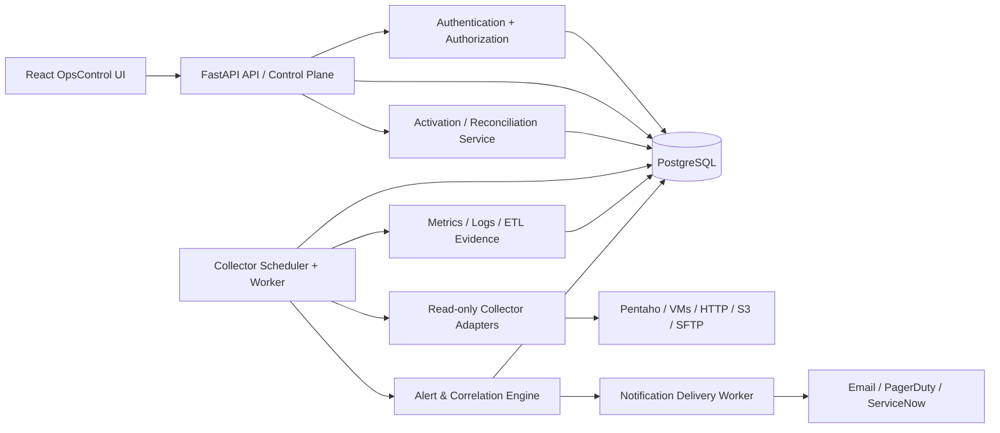

# 01 — System Architecture (Proposed)

## Architectural objectives
One operator console; authoritative organization-scoped data; read-only monitoring integrations; safe, replayable evidence ingestion; independently scheduled collectors; observable and idempotent alerts; simple local development. The product is a **modular monolith plus background workers**, not prematurely split microservices.

## Logical components

## Component boundaries
| Component | Owns | Explicitly does not own |
|---|---|---|
| React | Presentation, navigation, input validation, polling and visual evidence | Authentication policy, tenant scoping, scheduling, state of truth |
| FastAPI | Contract validation, identities and permissions, configuration CRUD, activation requests and queries | Long-running polling or privileged arbitrary commands |
| PostgreSQL | Organization-aware state, versioned configuration, source evidence, alert/notification history | External secrets, application logic |
| Activation service | Resolve/validate templates and idempotently provision effective config | Remote source installation or unapproved remediation |
| Collector runtime | Due-work claiming, transport adapters, bounded retries, run state, observations | Editing ETL jobs or modifying production workloads |
| Evidence/alert workers | Metric/log ingestion, rule evaluation, correlation, state transitions | Unsupported source guesses or confirmed RCA from weak signals |
| Notification worker | Delivery retries, provider-specific deduplication, audit | Rollback of source evidence or source-system mutations |

## Core data flows
1. **Onboarding:** Authenticated actor -> authorized Organization -> Data Source -> template attachment -> activation preview -> validated desired revision -> reconciled collector/metric/log/alert records -> worker claim -> sample/event -> dashboard.
2. **Investigation:** Source execution -> read-only normalized ETL facts -> historical record -> scoped evidence correlation -> alert -> notification -> operator review.
3. **Security:** Identity -> allowed organizations/roles -> policy decision -> SQL scope. The UI's selected organizations are preferences only, never authorization.

## Deployment topology
**Dev and CI:** React/Vite + one FastAPI app + PostgreSQL 17 + separately launched worker. CI uses ephemeral database and synthetic sources; no live customer integration. **Later deployment:** package existing modules into separate API/worker containers (same codebase) with managed PostgreSQL and external secrets. EKS/Helm/GitOps/Terraform follows functional acceptance rather than drives design.

## Reliability policies
- Workers must use DB-backed claiming/lease or a single-worker guarantee, plus idempotency keys and heartbeat/timeout.
- Failed transport must be `NO_RESPONSE` or collector `ERROR`, not automatically an ETL `FAILED`.
- DB commit of an observation must not depend on external notification success.
- UI distinguishes `no data`, `loading`, `stale`, `collector unavailable`, and actual business failure.
- Collection intervals and the UI's 5-second refresh are separate concerns; bound API query volume.

## Known boundaries from implementation
The current API adapter has a functioning **HTTP Basic** execution path and a confirmed metric sample; HTTPS currently needs correction (#4). WINDOWS, LINUX and PENTAHO are transport stubs (#7). Current wizard registers `OTEL` but the worker lacks an OTEL adapter (#8). Clarify whether OTEL is event ingestion via collector/agent or a polling adapter before production.

## Open design choices
OIDC identity provider, expected tenant scale, metrics cardinality, SLO targets, retention and data residency, first Pentaho read API, whether notification providers will be enabled in the first operational release.
