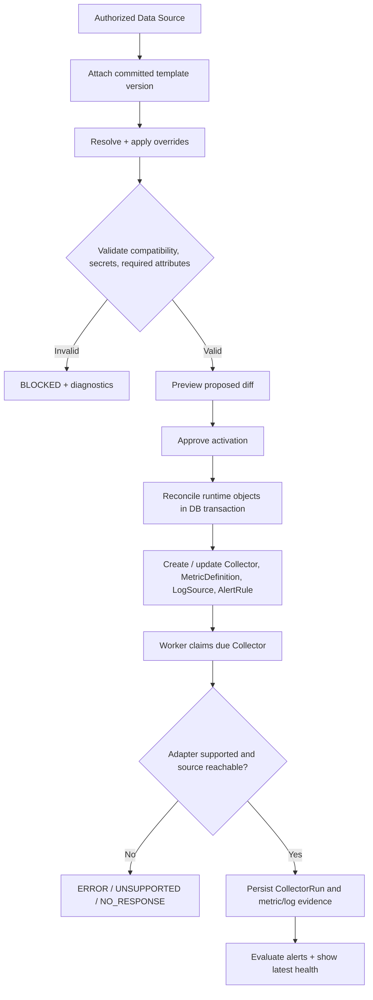

# 03 — From Monitoring Template to Live Monitoring

## Verified gap
In a disposable PostgreSQL environment, attaching a committed API template to a Data Source produced a valid effective configuration but **zero materialized collectors and metrics**. Manually creating an API Collector and availability MetricDefinition resulted in one successful CollectorRun and one MetricSample of `1.0`. See [Phase 1 CI evidence](https://github.com/Parikshit-Sahrawat/OpsControl_Dashboard/actions/runs/37987379543), issue #3.

## Desired state vs actual state
A template is a **versioned configuration declaration**, not an installed agent, scheduled collector, or proof of live telemetry. Introduce explicit activation and reconciliation; never label an attachment as `MONITORING` until it is active and observable.

## Proposed activation lifecycle
- `DRAFT` (config pending) -> `VALIDATED` -> `ACTIVATING` -> `ACTIVE` or `ERROR` / `BLOCKED`.
- `ACTIVE` = desired configuration provisioned, not automatically healthy source; runtime collector health tracked independently (`PENDING_INSTALL`, `RUNNING`, `HEALTHY`, `STALE`, `ERROR`, `UNSUPPORTED`, `STOPPED`).
- `DEACTIVATING` -> `INACTIVE` must disable generated resources without deleting historical evidence.

## Reconciliation algorithm (proposed)
1. **Authorize:** actor must manage the Data Source's organization; confirm source exists and is enabled.
2. **Resolve:** pin committed template versions, sort attachment priorities, deep-merge named components with deterministic override rules. Reject unresolved required attributes and incompatible collector types.
3. **Normalize:** convert template schema keys (collector, metrics, alerts, logs) into validated runtime schemas; map extractor methods to registered adapters; reserve secret references.
4. **Plan:** create a deterministic normalized payload and `desired_hash`. Compute additions/updates/disables against current generated entities; show diff to user.
5. **Commit atomically:** lock Data Source activation; upsert a monitored activation record and generated runtime entities using stable identities `(data_source_id, component_kind, component_key)`, applied version/hash and provenance. Ensure org consistency before SQL commit.
6. **Dispatch:** worker sees enabled due Collector and executes transport. Record run outcome, last attempt/success, metric/log counts and heartbeat.
7. **Report:** UI shows `configuration desired/applied`, `collector supported/registered`, `last run`, `last sample`, `last error`; never infer source health from mere attachment.
8. **Reconcile changes:** version upgrade or detach creates a diff and disables no-longer-desired components without deleting telemetry/history. Repeat same desired config => no duplicate collector/metrics/alerts.

## Component field mapping
| Template field | Runtime object | Note |
|---|---|---|
| `collector.type` / interval / transport | `Collector.collector_type`, `interval_seconds`, configuration | Must be supported or explicitly registration-only |
| `metrics[].metric` / method / unit | `MetricDefinition` | Map `query_config.extract` for supported API sampling |
| `alerts[].signal` / condition / threshold | `AlertRule` | Verify referenced MetricDefinition, standardize field vocabulary |
| `logs[].source` / path / parser | `LogSource` | Path values are read-only and appropriately scoped |
| `attributes[]` | resolved attribute values / secret refs | Required fields validated before activation |

## Agent vs collector choice
The UI currently creates `collector_type: OTEL` with `PENDING_INSTALL`, but the worker registers no OTEL adapter (#8). Model **agent registration** as a separate operational capability and require an actual OpenTelemetry receiver/ingestion path before calling it enabled monitoring. Use the already functioning API collector for the first positive end-to-end vertical slice; follow with Pentaho, Linux/Windows when real read-only transports exist.

## Failure, rollback and retry
- 4xx configuration error -> `BLOCKED` with reasons; no blind retries.
- Unreachable source / expired token -> collector `NO_RESPONSE/ERROR`, never ETL `FAILED` solely from transport.
- Concurrent activations serialized per source; generated row identities idempotent; no duplicate alert rules.
- Database transaction rollback keeps old applied configuration; if a remote install is ever introduced later, use a separate compensating workflow.
- Disable/detach does not delete run history; audit every desired and applied revision.

## Acceptance tests (P0)
1. A scoped admin attaches an API template; activation materializes exactly one supported collector and one availability metric definition.
2. Due collector produces a run and sample within configured interval; alert evaluates sample as configured.
3. Reapply same template: entity counts do not increase.
4. Edit template to new pinned version: preview diff, safe reconcile, history preserved.
5. Unsupported OTEL/Pentaho transport is explicitly `PENDING` or `UNSUPPORTED`, never `HEALTHY`.
6. Cross-tenant attachment and activation are rejected.
7. Detach disables generated config while historical evidence remains queryable by authorized actors.
