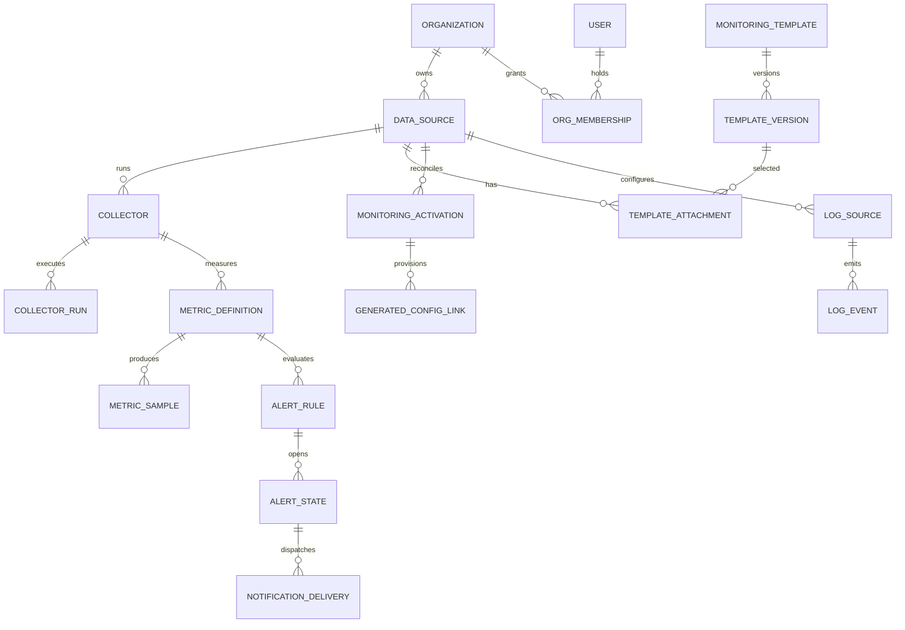

# 04 — Domain Model and Database Integrity (Proposed)

## Existing model
The current SQLAlchemy module defines `Organization`, `VM`, `Application`, `PentahoInstance`, `JobOrder/History/Step`, investigations/notes, `DataSource`, `Collector/CollectorRun`, `MetricDefinition/Sample`, `LogSource/Event`, `AlertRule/State/NotificationDelivery`, monitoring template/version/attachment, and correlation record/evidence.

These correspond to Alembic revisions 0001–0011. The fresh migration chain **passed** against PostgreSQL 17 on [run 37987379543](https://github.com/Parikshit-Sahrawat/OpsControl_Dashboard/actions/runs/37987379543) only **after** correcting revision 0001's duplicate enum creation on the unmerged review branch (#14).

## Proposed ERD (new entities shown explicitly)

## New entities — proposed, not migrated
| Table | Core fields | Constraints |
|---|---|---|
| `users` | id, issuer, subject, display_name, active, created_at | UNIQUE(issuer,subject) |
| `organization_memberships` | id, user_id, organization_id, role, active | UNIQUE(user_id, organization_id); indexed |
| `monitoring_activations` | id, organization_id, data_source_id, desired_hash, applied_hash, status, requested_by, requested_at, applied_at, failure | Unique active revision per Data Source; indexes on org/source |
| `generated_config_links` | id, activation_id, data_source_id, component_kind, component_key, generated_object_id, applied_version | UNIQUE(data_source_id, component_kind, component_key); provenance |
| `audit_events` | id, organization_id nullable, actor_id, action, object_kind/id, result, occurred_at, metadata_redacted | Append-only, actor/org time index |
| `collector_leases` (or fields on Collector) | collector_id, owner, lease_until, generation, heartbeat | Atomic claim and expiry |

An activation may generate one or more Collectors/MetricDefinitions/LogSources/AlertRules; maintain history and source identity when reconciling. Logical names and stable IDs must not be reused across unrelated tenants.

## Organization integrity
- `DataSource.organization_id` is authoritative for source-owned collectors.
- MetricDefinition, LogSource, AlertRule, MetricSample and LogEvent organization IDs must agree with their DataSource/Collector/definition lineage.
- A regular update cannot change `organization_id`; if ownership migration is required, use a privileged auditable transfer.
- Consider composite foreign keys or triggers for tenant consistency where PostgreSQL can enforce them; application validation remains mandatory. Migration design must not assume every existing row is consistent.
- Global templates need explicit visibility/ownership policy: platform-global versioned artifacts vs organization-local versions. Current `MonitoringTemplate.scope` describes resource scope, **not** tenant authorization.

## Event and metric storage
Metrics: `observed_at`, collector/run ID, definition ID, organization ID, numeric value, unit and dimensions. Logs: source ID, observed time, severity, message, bounded attributes and fingerprint. Alert transitions and notification deliveries remain independent of raw samples. Ensure indexed bounded queries for 5-second UI polling and retention cleanup without large transaction locks.

## Safe migration strategy
1. Inspect current schema vs metadata and record Alembic head.
2. Design additive migrations first; backfill before NOT NULL or unique constraints; validate tenant lineage.
3. Never rewrite production data through test scripts; CI uses disposable databases.
4. Gate each migration on fresh-db and **upgrade-from-previous-version** tests. Isolate downgrade tests to disposable DB.
5. Historical revision 0001 fix (#14) changes clean installations; audit existing environments before relying on any assumption about their revision stamps.
6. Do not add RLS without explicit tests of pooled connection behavior and worker access.

## Open questions
Retention targets (metric/log vs ETL histories), audit retention, field-level encryption, cardinality, expected organization count, archival/export, and PostgreSQL version support for deployment.
