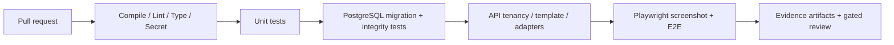

# 06 — Test Strategy and Acceptance Gates

## What is already executed
[Successful CI run 37987379543](https://github.com/Parikshit-Sahrawat/OpsControl_Dashboard/actions/runs/37987379543) ran clean PostgreSQL 17 migration, backend mapper/import/startup, frontend build, two artificial organizations, template attachment diagnostics, manual HTTP collector -> successful run + sample, and **11 actual browser PNG captures** without browser page errors. These are staging smoke tests, **not** evidence that auth/template checks pass.

## Test layers
| Layer | Technology (proposed) | Key checks |
|---|---|---|
| Static | Ruff + mypy (selected), ESLint, secret scanning | Style, type, dangerous code, unsafe configs |
| Unit | Pytest + React Testing Library | Template merging, validation, alert state transitions, parser and UI state |
| Database integration | Disposable PostgreSQL + Alembic | Fresh install, forward upgrade, constraints, organization lineage |
| API contract | Pytest httpx/TestClient with identity fixtures | AuthN/AuthZ, CRUD, status codes, pagination, overrides, idempotency |
| Adapter integration | Controlled test HTTP/SFTP/S3/Pentaho stubs | Timeout, TLS, malformed data, retries, read-only semantics |
| End to end | Playwright + seeded synthetic sources | Onboard -> activate -> collect -> alert -> investigate; count drilldowns |
| Reliability/security | Concurrent workers, load generator, failure injection | Leases, duplicate suppression, secret redaction, SSRF, tenant isolation |

## Critical acceptance scenarios
1. Org A/B tenants plus role matrix: anonymous returns 401, A can never read/write B, including IDOR and multi-select filters.
2. API template attachment alone shows `CONFIGURED`; activation materializes one collector, metric and valid execution (or explicit errors), survives replay.
3. Repeat same activation -> no duplicate generated entities; template version change and detach reconcile safely.
4. API probe over HTTPS succeeds with verified certificate; invalid/self-signed cert rejected unless explicitly approved development config.
5. A failed upstream source does not erase historical evidence; network outage not mislabeled ETL FAILED; retry bounded.
6. Two scheduler instances with same due Collector produce one claimed run per interval, or a documented single-worker limit.
7. Every KPI card opens a filtered list with matching authorized totals, for Overview and Resource Management.
8. Browser snapshots of all seven nav routes and four nested views exist, with planned routes correctly indicated as placeholders until implemented.
9. Migration from known deployed revision to head has no unintended destructive operations; backup/rollback documented.

## CI pipeline proposed

## Pass/fail semantics
- **Diagnostic smoke workflow success** means steps and probes executed; known security/template failures remain explicitly recorded in `release_blockers`.
- **Product quality gate success** requires all mandatory negative, integration, migration and E2E assertions to pass; known failures should make the quality gate red.
- No skipped/xfail result can be counted as implemented functionality or release approval. Publish failed assertion/trace and issue links.
- Store synthetic screenshot artifacts with manifests, branch SHA and fixture version. Do not include production secrets/customer details in public uploads.

## Test data and reproducibility
Fixed synthetic organizations A/B, known roles/permissions, API fixture returning deterministic status, stub Pentaho executions, service health and alert thresholds. Each CI run uses a fresh disposable PostgreSQL service; no shared production/staging customer database. Record CLI commands, versions, migration head, failure logs and link to run in audit.

## Internal Application UI verification gate
The HTTP probe, private runner, browser synthetic, authorization, SSRF, TLS, freshness, alert and E2E cases are specified as APP-001 through APP-018 in [13 — Internal Application UI Monitoring](13-INTERNAL-APPLICATION-UI-MONITORING.md#12-acceptance-and-release-tests-all-required-for-each-delivered-tier). Tests for unsupported tiers must be marked not implemented, never passed.

## Current gaps
No pytest suite or ESLint command exists yet (#6). The current staging probe lacks authenticated identities because the system has no auth implementation (#2). Screenshot capture verifies rendering but not accessibility or all user interactions. True template-to-sample from an attached template fails (#3); only manual collector path passes.
