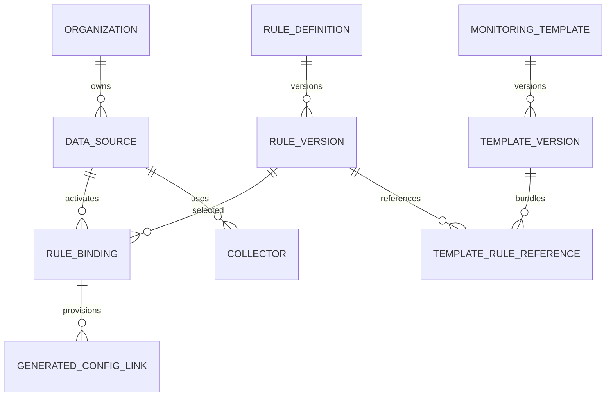

# 09 — Independent Metric, Log and Alert Rules (Proposed, Implementation On Hold)

## Design intent
Monitoring templates should no longer be the only container for metric/log/alert definitions. Separate a reusable, versioned **rule catalog** from Data Source bindings and optional template bundles.

### Three independently managed rule types
1. **Metric Rules** define collection and transformation: metric key, source/collector compatibility, unit, method/query/extractor, interval/aggregation, labels, validation and expected freshness. They produce MetricDefinitions and MetricSamples when activated.
2. **Log Rules** define sources and parsing: log path/stream, transport, parser, match/extract patterns, severity mapping, field extraction, redaction, retention and correlation keys. They produce LogSources and normalized LogEvents.
3. **Alert Rules** define evaluation of metric samples, log events or combinations: expression, thresholds, evaluation window, missing-data policy, severity, cooldown, deduplication, recovery condition and notification routing. They produce AlertStates and delivery records.

Rules can be created and versioned separately; enabled/disabled independently; bound to multiple compatible Data Sources. Template becomes an optional pinned **bundle of rule-version references plus collector configuration**, not the only rule authoring mechanism. Do not silently propagate new catalog versions to already activated sources; require preview and approval.

## Proposed model

Suggested `RULE_DEFINITION` fields: id, owner_organization_id nullable (platform-global), type METRIC/LOG/ALERT, stable key, name, resource_compatibility, description, status, created_by. `RULE_VERSION`: rule_id, version, validated JSON config, immutable checksum, state DRAFT/PUBLISHED/RETIRED. `RULE_BINDING`: organization_id, data_source_id, rule_version_id, enabled, overrides, applied_revision, provenance (direct/template), status, last_error. Add unique stable binding identities and cross-organization integrity checks.

## Activation
1. Authorized admin selects a Data Source and attaches individual rules or a template bundle.
2. Resolve rule versions, required collector types, dependencies and secret references; validate compatibility and permissions.
3. Preview resulting metric/log/alert objects, scheduling load and any conflicting rules.
4. Activate idempotently through the existing proposed reconciliation service; bind generated entities to source/rule provenance.
5. Collect and persist metric/log evidence, evaluate alert expressions, show status and failures.
6. Disable a binding without deleting evidence; retain versioned audit history. Reapplication must not duplicate generated rows.

## UI proposal
Resource Management → **Rules** with tabs **Metric Rules | Log Rules | Alert Rules**; searchable reusable catalog, scope/compatibility, owner, status, version, references and usage count. Data Source detail → **Monitoring** with independently attachable rules, an optional template picker, activation preview and live evidence. Templates → **Bundles** with references to pinned rule versions.

## Examples
- EC2 metric rule: CloudWatch `CPUUtilization` percentage; alert rule: average CPU > 85% for 5 minutes; missing-data policy = UNKNOWN, not HEALTHY.
- Apache log rule: match and aggregate HTTP 5xx events; alert rule: 5xx rate > 5% for 5 minutes.
- Kubernetes metric rule: deployment available replicas / desired replicas; alert rule: availability below 100% for 3 consecutive observations.
- Internal UI: HTTP availability and response-time metric rules; alert rule: 3 failures in 5 minutes.
- Pentaho: ETL execution duration metric and failure log/event rule; alert rule: workflow fails or exceeds approved runtime baseline.

## Constraints and review questions
- Require a supported adapter for each Metric/Log Rule; catalog presence alone never proves runtime capability.
- Enforce server-side org permissions for global/organization-local rules and bindings.
- Clarify how multiple bindings share a collector, aggregation window/timezone, and whether alerts can depend on multiple Data Sources.
- Preserve backward compatibility with current `MonitoringTemplate.package_config`; migration should normalize existing embedded rules into versioned catalog entries with provenance.
- Alert evaluation time uses UTC instants; timezone only affects presentation or explicit calendar schedules.

## Acceptance criteria (design)
- Independently create, edit draft, publish version, retire, bind and disable each rule type.
- One rule version can be bound to multiple authorized compatible sources without cross-tenant leakage.
- Template bundles resolve to pinned rule versions; direct rules and template rules use one reconciliation path.
- No duplicate generated entities on repeat activation; rule version changes are reviewed.
- End-to-end API rule -> metric sample -> alert transition; Apache log -> parsed event -> alert; unsupported collectors visibly BLOCKED.
- Logs/metrics remain available after deactivation subject to retention.

**Status:** Proposed Phase 2 design only. No runtime code or database migration is authorized by this document.
