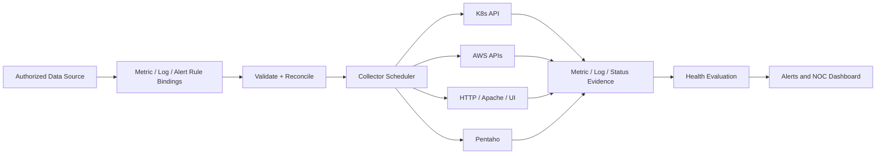

# 10 — Infrastructure and Application Health Collectors (Proposed, On Hold)

## Unified health dimensions
Track independently **transport/connectivity**, **host/cluster health**, **service/process health**, **application correctness**, **performance** and **data freshness**. A reachable host is not proof of a healthy app. States: HEALTHY, WARNING, CRITICAL, UNKNOWN/STALE, plus separate collector state ERROR/UNSUPPORTED. Record observed timestamp, source identity and evidence link.

## Collector design
| Target | Read-only transport | Metrics/evidence | Prerequisites |
|---|---|---|---|
| Kubernetes Pods/Deployments | Kubernetes API; Metrics API for CPU/memory | Phase, Ready, restart count, CrashLoopBackOff, OOMKilled, pending, desired/available replicas, CPU/memory if Metrics API available | Cluster network access, namespace-scoped service account/RBAC, secure TLS |
| AWS EC2 | EC2 Describe APIs + CloudWatch | Instance state, system/instance status checks, CPU, network, EBS metrics; memory/disk only with agent or equivalent | Least-privilege IAM role, region/account, CloudWatch metric namespace |
| Apache HTTP Server | HTTP(S), optional protected `mod_status`, OS collector | HTTP status, response latency, workers/connections, 5xx rate, TLS expiry; process state via OS agent | Reachable endpoint, secure status access, optional agent |
| Apache Tomcat | HTTP(S), optional JMX / secured management metrics | Application availability, JVM memory, threads, response latency, error rate, process state | Secured management endpoint; no public JMX exposure |
| Internal UI/API | HTTP(S) checks; optional browser synthetic runner | DNS/TLS, status code, expected content, latency, auth dependency, multi-step UI journey | Network-local runner, test identity/credentials via secret refs, bounded probes |
| Pentaho ETL | Approved read-only Pentaho API/DB/log adapter | Execution state, job duration, latest run, failure step, freshness and missing run | Supported production read interface; no arbitrary ETL mutation |

## Architecture

## Security and reliability
- API credentials, AWS roles, K8s service account tokens, JMX secrets and browser synthetic accounts must never appear in template JSON or logs; use secret references.
- Remote private application checks run from a customer-network-local worker/agent, never by exposing internal endpoints publicly.
- Enforce network egress/SSRF restrictions for user-configured HTTP checks, verify TLS and bound timeouts/response sizes.
- Polling interval per collector is independent of UI refresh (default 5 seconds); throttle high-cardinality K8s/CloudWatch queries and respect API quotas.
- Separate missing metrics from genuine healthy status; collect last-success and stale threshold.
- Avoid running browser synthetic checks at 5-second intervals by default.

## Phased implementation suggestion (not authorized yet)
1. Extend proven HTTP API collector into availability/latency/content/TLS rules.
2. AWS EC2 instance and CloudWatch metrics.
3. Kubernetes namespace/pod/deployment and Metrics API collector.
4. Apache/Tomcat deep service metrics and protected logs.
5. Internal browser synthetics and approved Pentaho integration as independently planned workstreams.

## Acceptance evidence
- Real/simulated provider API fixtures for healthy, degraded, down, stale and permission-denied cases.
- Credential/TLS negative tests, org isolation, retries and API throttling tests.
- Correlate host healthy + app HTTP 503 as application CRITICAL.
- Prove supported collector -> evidence -> health -> alert end-to-end; show UNSUPPORTED for stub adapters.

**Status:** Architecture design only. Implementation intentionally on hold.
