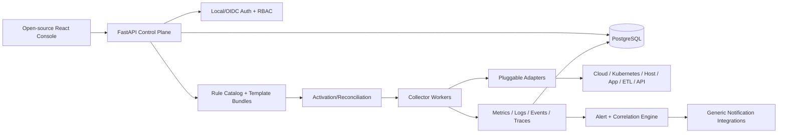

# 12 — Universal Open-Source Product Principles

**Status:** Phase 2 design policy; implementation remains on hold.

## Product positioning
OpsControl is a **general-purpose, open-source monitoring and observability platform** for infrastructure, applications, jobs, APIs, logs, metrics and incidents. It is independently designed from general industry practices and hands-on operational experience. It is **not** a product for any particular employer, customer, supply-chain platform or proprietary environment.

## Design constraints
1. **Vendor-neutral core:** Data Source, Resource, Collector, Metric Rule, Log Rule, Alert Rule, Evidence, Incident, Organization, Agent and Integration are portable domain concepts.
2. **Adapters not assumptions:** Kubernetes, AWS, Azure, Linux, Windows, Apache, Tomcat, databases, S3, SFTP, HTTP and ETL engines are optional provider plugins. A generic job-monitoring model must not require Pentaho, a specific employer's scheduler, or proprietary ETL naming.
3. **Configurable deployment:** Single-machine self-hosted mode first; optional multi-organization/tenant mode with enforced authorization. No hidden dependence on one organization's network, identity provider or infrastructure.
4. **Portable integrations:** Define a versioned collector interface, capability declaration, configuration schema, health/error semantics, credential reference contract, test fixtures and extension documentation.
5. **Three reusable rule catalogs:** Independent Metric Rules, Log Rules and Alert Rules, each versioned and bindable to compatible resources; templates are optional bundles of pinned rule versions.
6. **Standards-based observability:** Support portable semantics for timestamps, labels, logs, metrics, traces and correlation; plan OpenTelemetry interoperability without implying unimplemented ingestion support.
7. **Real observability:** Differentiate configured, collector running, evidence fresh, resource healthy, and alerts active. Never mark unsupported or unverified integrations healthy.
8. **Open-source readiness:** Clear license decision, CONTRIBUTING.md, CODE_OF_CONDUCT.md, SECURITY.md, public roadmap, architecture docs, local quickstart, example dashboards and integration developer guide. Do not claim a license or contributor governance exists until implemented.
9. **Safe demo defaults:** Seeded fictional organizations, synthetic telemetry, sample hosts such as `api.example.test`, non-sensitive identifiers, no live production connection or customer screenshots.
10. **Provenance and publication review:** Independently author implementation and docs. Exclude employer/customer proprietary information, private runbooks, internal hostnames/URLs, screenshots, data dumps, credentials and non-public source code. Run secret and sensitive-data checks before public releases. General experience is a legitimate inspiration, but generic wording alone does not resolve intellectual-property obligations.

## Neutral feature vocabulary
| Avoid organizational coupling | Prefer public product vocabulary |
|---|---|
| Internal workflow/job names | Generic job and scheduled task |
| Customer-specific tenant names | Fictional example organizations |
| Proprietary incident escalation conventions | Configurable incident and notification policy |
| Employer-specific ETL application screens | Standard connector and normalized execution model |
| Single cloud/vendor dependence | Optional provider adapters with capability flags |
| Hardcoded company SLAs | User-defined SLOs, freshness windows and alert policies |

## Proposed generic reference architecture

## Acceptance criteria for Phase 2
- All architecture documents, sample data and demo flows are employer/customer neutral.
- Public quickstart works with synthetic sources and no private environment access.
- Collector contract supports new provider integrations without modifying core resource model.
- Monitoring templates reference independent versioned metric/log/alert rules.
- All demo screenshots come from seeded synthetic data and are labeled accordingly.
- A release checklist verifies licensing, security and public-safe content before publication.
- Product security, tenancy and activation defects remain tracked rather than concealed.

**Boundary:** This is a design and public-release policy. It does not imply code, licensing, secret scans or source audits have already been completed.
