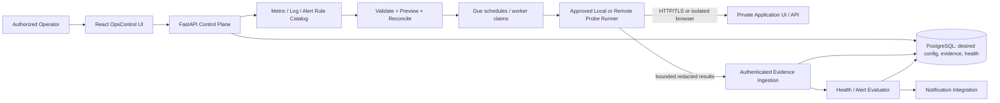

# 13 — Internal Application UI Monitoring: HTTP Probes and Browser Synthetics

**Status:** Phase 2 detailed design specification. **Proposed; not yet implemented, tested, or production-approved.**

**Goal:** Allow any self-hosting organization to monitor private/internal web applications (dashboards, portals, admin consoles, and APIs) without publishing those applications on the Internet or adding organization-specific logic to OpsControl. Measure **reachability**, **functional correctness**, **user journey**, **latency**, and **freshness** separately. A successful TCP connection or HTTP 200 is **not** evidence of a functioning application.

**Dependencies:** [architecture](01-ARCHITECTURE.md), [tenant/security design](02-TENANCY-SECURITY.md), [activation/reconciliation](03-MONITORING-ACTIVATION.md), [API conventions](05-API-CONTRACTS.md), [verification](06-VERIFICATION.md), [separate metric/log/alert rules](09-RULE-CATALOG-DESIGN.md), [collector catalog](10-INFRASTRUCTURE-COLLECTORS.md), and [open-source neutrality](12-OPEN-SOURCE-PRODUCT-PRINCIPLES.md).

For the infrastructure-wide discovery manager, provider adapters and outbound-only remote agent pool, see [14 — Resource Discovery and Infrastructure Monitoring](14-RESOURCE-DISCOVERY-INFRASTRUCTURE-MONITORING.md).

## 1. Scope, tiers and exclusions

| Tier | Mode | Verification | Minimum infrastructure |
|---|---|---|---|
| H1 | **HTTP(S) probe** | DNS/TCP/TLS, status, response time, bounded headers/JSON/text match, optional authenticated read-only API | HTTP adapter on a trusted worker with target network access |
| H2 | **Multi-endpoint HTTP transaction** | Sequential calls, safe extracted variables, session handling, assertions against a representative workflow | HTTP transaction executor; secret references |
| S1 | **Browser synthetic** | Real browser navigation, authenticated login with *dedicated test account*, selectors, expected text, functional steps, screenshot on failure | Isolated Playwright/Chromium runner deployed near app |
| S2 | **Advanced synthetic** (later) | Web Vitals, multi-region/worker comparison, approved trace correlation | Optional extensions; not a Phase 2 MVP promise |

**Out of scope for initial delivery:** real-user monitoring (RUM), arbitrary customer JavaScript execution in the API server, screen scraping private production customer records, destructive user actions, auto-remediation, invasive session capture, and promises of universal SSO support. An OpenTelemetry/tracing link may be added when trace ingestion is available; no claims that traces are collected today.

## 2. End-to-end topology and trust boundaries



- **Control plane** stores *desired configuration*, policies and references; **probe runners** perform outbound requests.
- For an RFC1918/VPN/cluster-only target, deploy the runner **inside the operator-controlled network**. The control plane **never needs an inbound public route** to the monitored UI.
- The remote runner uses a mutually authenticated **outbound** channel to retrieve scoped work and submit results. Initial prototype may support polling over HTTPS; no arbitrary inbound command endpoint is required.
- Scope each job to an authorized `organization_id`, `data_source_id`, `probe_id`, `runner_pool_id` and immutable configuration revision. Server validates scope on **both** dispatch and ingestion.
- Define **configured**, **assigned**, **running**, **sample_received**, **health_evaluated** and **alert_active** as separate states; a scheduled or registered probe is not considered operational without fresh results.
- Provider-neutral: any organization can supply its own URL, auth flow, expected assertions, runner pool and escalation policy.

## 3. Resource/collector onboarding and UI

**Path:** Resource Management → Data Sources → Add Data Source → **Internal Application** (`INTERNAL_WEB_APP`). The operator chooses `HTTP_CHECK`, `HTTP_TRANSACTION`, or `BROWSER_SYNTHETIC`, then selects a reachable runner pool.

**Wizard fields and validation**

| Group | Field | Default/constraint |
|---|---|---|
| Identity | Organization, name, environment, labels, owner/team | Organization must come from authorized memberships. Name unique within organization as appropriate. |
| Target | Base HTTPS URL, optional expected hostname, paths, DNS override **not supported** | HTTPS required outside explicitly approved local test mode; no URL userinfo; reject unsupported schemes. |
| Runner | Runner pool / network location, capabilities | Must be online, trusted and scoped to organization; browser probes require browser capability. |
| Probe | HTTP method GET/HEAD by default, path, headers allowlist, body assertion | Do not expose arbitrary mutating methods in general availability checks. |
| Response checks | Status allowlist; response body JSONPath/regex/text with strict bounds; redirect policy | Example: 200 and `$.ready == true`; a 200 response alone is not sufficient when an application check is configured. |
| Authentication | NONE, BASIC, BEARER, API_KEY, COOKIE_SESSION or managed browser login | Store `credential_ref` only. Support SSO/OIDC via approved dedicated non-interactive/test account flows; prohibit hardcoded passwords. |
| Browser journey | URL, actions (navigate, fill via secret, click, waitFor, assert), stable selector, max steps | Declarative and versioned; no arbitrary JS; no state-changing submit without explicit safe-test policy. |
| Scheduling | `interval_seconds`, jitter, timezone for display, maintenance windows | Suggested HTTP default 60 s and browser 300 s; minimum and quotas configured by operator. UI 5 s refresh is **not** probe polling. |
| Networking | connect/read/total timeouts, max redirects, max bytes, allowed hosts, approved private CIDRs | Bounded by runner policy; changes require authorization/review. |
| Failure policy | Retry count, consecutive failures to mark DOWN, consecutive successes to recover, stale threshold | Avoid flapping and alert storms; defaults below. |
| Diagnostics | Redacted headers/status timings, failure reason; opt-in screenshot on synthetic failure | Never retain token, typed password, HTML containing sensitive data, or session cookies. |

Wizard progression: **Choose Data Source → Choose runner → Configure checks → Bind Metric/Log/Alert Rules → Connectivity preflight → Preview generated objects and risk → Activate → Live evidence**. A probe that cannot be assigned to a runner remains `BLOCKED` with an actionable explanation; no green HEALTHY badge.

**HTTP checks** produce numeric/enum observations. **Browser synthetics** prove user-visible behavior beyond raw API reachability: e.g., login page loads, dedicated test user signs in, dashboard element appears, app navigation works, and an authorized *read-only* summary is displayed. Synthetic accounts/data must be isolated from actual users.

## 4. Collector interface and scheduling

Adapter type: `http_probe.v1`; optional `http_transaction.v1` and `browser_synthetic.v1`. All implement the generic worker contract:

```text
validate(config, runner_capabilities) -> {valid, warnings, errors}
preflight(config, scoped_secret_ref, runner_policy) -> {reachable, diagnostics}
execute(run_context) -> ProbeResultV1
capabilities() -> {mode, auth_methods, check_types, limits, version}
```

`run_context` contains source/probe identity, configuration revision, deadline, worker lease, trace/correlation ID, *scoped* secret handle and effective egress policy. Actual secret resolution happens within the runner, not API request serialization.

**Scheduling design:**
- A scheduler claims one unique `(probe_id, planned_for)` execution using a database lease/fencing token and enqueues only to an eligible runner.
- Default intervals: HTTP **60 s**, browser **300 s**; configurable within enforced tenant/runner capacity. Stagger with jitter, do not align thousands of targets at the same second.
- Recommended per-attempt limits: HTTP connect 3 s, total 10 s; browser journey total 60 s; response body 64 KiB (or smaller by policy), maximum 3 redirects, 0–1 short bounded retries. These are **design defaults**, subject to product-level configuration and test.
- Concurrency caps per tenant, runner, and target; backoff when unavailable. No overlapping journey for the same check unless explicitly supported.
- Schedules use **UTC instants**, even when the homepage clock shows another timezone.
- Retried probe attempts have separate attempt IDs; only a deduplicated planned run contributes to availability SLI/alert evaluation. Retrying must not duplicate metric samples/notifications.

## 5. Security and privacy threat model (mandatory before release)

| Threat | Required control |
|---|---|
| Unauthenticated or cross-tenant CRUD/reads (known P0 #2) | AuthN, capability-based RBAC, server-side org membership, scoped lists, nested resources and evidence; deny by default. |
| SSRF / cloud metadata exfiltration | Strict scheme/port/host allowlists; **no arbitrary** remote addresses. Control-plane runner policy explicitly authorizes private CIDRs only for network-local deployment. Block loopback, link-local, metadata addresses, multicast, IP literals as required by policy, and unexpected public/private transitions. |
| DNS rebinding / redirects | Resolve using approved resolver; verify all resolved A/AAAA addresses against egress policy; connect to validated address with hostname/TLS verification; revalidate each redirect and resolved hop. Enforce network firewall/egress segmentation **in addition** to application checks. |
| Credential leakage | Secrets referenced by opaque IDs; encrypted secret provider; least-privilege dedicated synthetic account; no secrets in URL, UI payload, logs, DB config, screenshots, HAR or error messages; restrict read/rotation. |
| Browser escaping sandbox | Isolated, non-root short-lived browser/container with CPU/memory/time quota, restricted filesystem/permissions, egress-limited profile, no access to control-plane credentials or host network. Treat target content as untrusted. |
| Login tests mutate real data | Synthetic tenant/test identity and **read-only journey** by default; explicit audited exception for dedicated safe test fixture. Forbid admin/delete/payment/submit endpoints unless controlled in test environment. |
| TLS bypass / authentication downgrade | Verify certificate and hostname by default; no silent `verify=false`, no credential forwarding across domains/redirects, limit cookie domain scope. |
| Evidence contains PII | Allowlisted result fields, truncation, redaction of query params and response content, screenshot off by default, region-specific retention and deletion, role-restricted access. |
| Probe abuse and DoS | Minimum intervals, timeouts, body limits, concurrency, quotas and rate limits; audit every configuration/test-run and runner registration. |
| Forged or replayed results | Short-lived service identity, scoped ingestion auth, unique event IDs, replay protection, server-reconciled `probe_id` and `config_revision`; reject unauthorized runner or org. |

**Critical distinction:** Probing RFC1918/private endpoints is a legitimate use case **only on an organization-approved local runner** with explicit allowlists. Never interpret “internal application” as blanket permission for an externally hosted OpsControl instance to reach private addresses.

**Supply-chain:** Pin and update browser binaries and base images, track vulnerabilities, sign trusted runner packages where feasible. Runner upgrades/compatibility should be visible in UI.

## 6. Metric, log and alert rule design

**Metric Rules** (independent, reusable, versioned; outputs include):
- `probe_up` gauge (1/0; 0 means test failed, **not** always target down).
- `http_status_code` gauge, when a response was received; absent if no response.
- `http_response_duration_seconds` histogram/summary or numeric latency sample.
- `dns_lookup_duration_seconds`, `tcp_connect_duration_seconds`, `tls_handshake_duration_seconds` where measured.
- `tls_certificate_days_remaining` gauge; certificate expiry threshold warning.
- `http_assertion_pass` and `synthetic_journey_success` gauges (1/0).
- `synthetic_step_duration_seconds` and `synthetic_failed_step` as bounded dimensions/event fields.
- `probe_last_success_timestamp_seconds` and `probe_result_age_seconds` for freshness.
- Optional `http_redirect_count`, response byte size, availability window percentages, and latency p95 derived from stored samples.

**Log Rules** capture **structured probe events**, not full HTML or user-session recordings: `ProbeStarted`, `ProbeSucceeded`, `ProbeFailed`, `AssertionFailed`, `TLSError`, `AuthError`, `RunnerUnavailable`. Fields: timestamp, run/probe/source ID, sanitized URL host/path, failure classification, step name/index, status, duration, attempt count, runner ID and redacted error category. Avoid automatic storage of raw response bodies.

**Alert Rules** evaluate published metrics/events using configurable windows and suppression:
- Availability: 3 consecutive failed *scheduled runs* within 5 minutes → CRITICAL; 2 consecutive successes → recovery.
- Slow UI: 5-minute latency p95 > configured threshold with minimum sample count → WARNING.
- TLS expiry: <14 days → WARNING; <3 days → CRITICAL, where cert data is available.
- Synthetic login/assertion failure: 2 consecutive journey failures → CRITICAL (policy configurable).
- No successful/new observation for >2× expected cadence + grace → **UNKNOWN/STALE** and separate `MONITORING_BLIND` alert; **never HEALTHY**.
- Runner or credential failure → `MONITORING_ERROR` (diagnostic), **not** proof of application outage.
- Alert identity: `(organization_id, data_source_id, probe_id, rule_version_id)`; dedupe repeated evaluations, honor maintenance, cooldown, acknowledgements and recovery.

**Dependencies:** Bind metric rules for evidence first, log rules for classifications, alert rules to active compatible evidence. Templates reference pinned versions of these three rule classes. Deactivation stops collection and evaluation but preserves historical results per retention policy. If the requested adapter is unsupported, activation must return a visible validation/blocking state.

## 7. Health semantics and correlation

Separate **collector/runner health** from **target/application health**.

| Observation | Target health | Collector health | Meaning |
|---|---|---|---|
| HTTP 200 **and required assertion passes** | HEALTHY | OK | Application passed defined contract. |
| HTTP 200 but login/dashboard assertion fails | CRITICAL after threshold; otherwise WARNING | OK | UI available but functional check failed. |
| HTTP 503 / repeated connection refused | CRITICAL after threshold | OK | Application unavailable from this probe vantage point. |
| High latency or TLS near expiry | WARNING | OK | Degradation or impending risk. |
| HTTP 401/403 for configured test account | UNKNOWN or WARNING + AUTH_ERROR (unless policy defines auth response as target contract) | OK | Credential/authorization problem; do not automatically infer full outage. |
| DNS resolver/network/runner failure | UNKNOWN | ERROR | Monitoring blind spot, not conclusive app outage. |
| No run beyond freshness window | UNKNOWN/STALE | STALE | Never retain previous green status indefinitely. |
| Expected maintenance window | MAINTENANCE | OK/UNKNOWN | Suppress notifications as configured, preserve observations. |
| Single failing target region/runner pool | Per-vantage CRITICAL; aggregate based on quorum policy | Other vantages independent | Distinguish local routing problem from global app outage. |

Use configurable fail/recovery thresholds with hysteresis; record raw run result separately from derived health state. Evaluate priority: **no fresh evidence → UNKNOWN**; **monitoring environment failure → UNKNOWN/MONITORING_ERROR**; **functional check failure → CRITICAL/WARNING per rule**; **performance threshold → WARNING**; **all mandatory assertions pass → HEALTHY**. Health is **source-scoped**, **rule-version-scoped** and time-bounded.

**Example:** EC2 instance checks pass, Apache responds 200, but the internal portal cannot load an expected dashboard element. OpsControl shows **host HEALTHY / HTTP endpoint HEALTHY / application synthetic CRITICAL** and surfaces the failing journey step instead of collapsing all layers to “healthy”.

## 8. Proposed data model

Add/change entities through reviewed Alembic migrations; never equate proposed names with existing tables:

| Entity | Essential fields |
|---|---|
| `app_probes` | id, organization_id, data_source_id, name, mode, config_revision, target_url, runner_pool_id, enabled, status, created_by, timestamps |
| `runner_pools` | id, organization_id, name, network_scope_policy_id, capabilities, max_concurrency, status |
| `probe_steps` (or versioned journey JSON) | probe_id, step_index, action_type, safe selector/condition, timeout_ms, credential_reference |
| `probe_schedules` | probe_id, interval_seconds, jitter, maintenance_window_id, last_planned_at, next_due_at |
| `probe_runs` | id, planned_for, config_revision, runner_id, started_at, ended_at, final_outcome, classification, attempt_count, timings, sanitized_target, evidence_hash |
| `probe_step_results` | run_id, step_index, outcome, sanitized_failure_category, duration_ms |
| `probe_health_states` | probe_id, health, monitoring_health, computed_at, last_sample_at, consecutive_failures, consecutive_successes, reason |
| `probe_evidence_artifacts` | id, run_id, restricted location, artifact_type, redaction_status, retention_expiry, access_policy |
| `rule_bindings` | org/data-source/probe, immutable rule_version_id, provenance (direct/template), applied_revision |

**Integrity:** Scope every child by the authenticated parent Data Source and organization; disallow cross-org foreign-key combinations. Unique constraint `(probe_id, planned_for)` and unique event IDs support idempotency. Index by `(org, probe, observed_at DESC)` and `(org, status)`. All timestamps UTC; persist bounded numeric timings; retention/capacity per organization.

**Migration:** Add new tables and enums, backfill carefully from existing HTTP collectors where semantics map exactly; never assume old `Collector.status=SUCCESS` means `probe_health=HEALTHY`. Keep existing collector/run/samples contracts readable during transition, record provenance and deprecate redundant routes in a versioned migration.

## 9. Proposed API and worker event contracts

**Conventions:** All endpoints require valid identity and organization-scoped permissions. `GET` read access as permitted; create/update/activate/preflight requires org-admin or delegated operator policy. Use `401` unauthenticated, `403` unauthorized (or consistent masked `404`), `404` missing, `409` concurrent revision/mismatch, `422` invalid unsafe configuration, `429` quota/rate limit, `503` unavailable runner/secret provider. Stable JSON errors `{code, message, request_id, details?}` with **redacted** detail. Use cursor pagination and RFC 3339 UTC timestamps.

| Method | Path | Purpose / result |
|---|---|---|
| `GET` | `/api/v1/data-sources/{source_id}/probes` | Authorized, paginated configured probes and current state |
| `POST` | `/api/v1/data-sources/{source_id}/probes` | Create `DRAFT` probe with validated config (`201`) |
| `GET` | `/api/v1/data-sources/{source_id}/probes/{probe_id}` | Config metadata (no secrets), validation issues, current state |
| `PATCH` | `/api/v1/data-sources/{source_id}/probes/{probe_id}` | Update desired revision using `If-Match` |
| `POST` | `/api/v1/data-sources/{source_id}/probes/{probe_id}/preflight` | Authorized bounded connectivity test (async `202`); no evidence-health change |
| `POST` | `/api/v1/data-sources/{source_id}/activation-preview` | Validate templates/direct rules, runner requirements, secret references and diff |
| `POST` | `/api/v1/data-sources/{source_id}/activations` | Existing proposed idempotent activation route; includes probe binding |
| `GET` | `/api/v1/data-sources/{source_id}/probes/{probe_id}/runs` | Paginated summaries, per-step outcomes, timestamps |
| `GET` | `/api/v1/data-sources/{source_id}/probes/{probe_id}/health` | Health+monitoring state, reason, latest evidence, freshness |
| `GET` | `/api/v1/data-sources/{source_id}/probes/{probe_id}/metrics` | Bounded samples, unit and rule provenance |
| `GET` | `/api/v1/data-sources/{source_id}/probes/{probe_id}/events` | Sanitized structured events, no raw HTML |
| `POST` | `/api/v1/runner/probe-results` | Runner-only scoped, idempotent evidence ingestion (`202`/`200`) |

The `/runner/*` namespace is for authenticated runner identities **only**, not browser callers. Dispatch/claim APIs may be separate versioned contracts and must authorize `runner_pool_id` and config revision. Source ID and probe ID must agree with authenticated scope on every route.

### Example A — Create HTTP probe (illustrative)

```http
POST /api/v1/data-sources/{source_id}/probes
Authorization: Bearer <user_access_token>
Content-Type: application/json
```

```json
{
  "name": "Example internal dashboard readiness",
  "mode": "HTTP_CHECK",
  "runner_pool_id": "11111111-1111-4111-8111-111111111111",
  "config": {
    "url": "https://dashboard.example.test/health/ready",
    "method": "GET",
    "accepted_status": [200],
    "assertions": [{"type": "JSON_PATH_EQUALS", "path": "$.ready", "expected": true}],
    "auth": {"type": "BEARER", "credential_ref": "secret://sample/readonly-ui-probe"},
    "interval_seconds": 60,
    "timeout_seconds": 10,
    "redirects_max": 2
  }
}
```

Response `201` (no credential material):

```json
{
  "id": "22222222-2222-4222-8222-222222222222",
  "data_source_id": "<source_id>",
  "status": "DRAFT",
  "config_revision": 1,
  "validation": {"valid": true, "warnings": []}
}
```

### Example B — Create declarative browser journey

```json
{
  "name": "Portal navigation smoke",
  "mode": "BROWSER_SYNTHETIC",
  "runner_pool_id": "11111111-1111-4111-8111-111111111111",
  "config": {
    "base_url": "https://portal.example.test",
    "interval_seconds": 300,
    "timeout_seconds": 60,
    "auth": {"type": "TEST_ACCOUNT", "credential_ref": "secret://sample/synthetic-user"},
    "steps": [
      {"action": "NAVIGATE", "path": "/login"},
      {"action": "ASSERT_VISIBLE", "selector": "[data-testid='login-form']"},
      {"action": "FILL_SECRET", "selector": "[data-testid='username']", "field": "username"},
      {"action": "FILL_SECRET", "selector": "[data-testid='password']", "field": "password"},
      {"action": "CLICK", "selector": "[data-testid='login-submit']", "safe_action": "test-login"},
      {"action": "ASSERT_VISIBLE", "selector": "[data-testid='dashboard-ready']"}
    ],
    "capture_on_failure": false
  }
}
```

Only allow `CLICK` against an authorized, audited allowlist of synthetic-safe actions; no arbitrary script source or general browser automation supplied by untrusted callers.

### Example C — Sanitized runner result

```json
{
  "schema_version": "probe_result.v1",
  "event_id": "33333333-3333-4333-8333-333333333333",
  "organization_id": "<authorized-organization-id>",
  "data_source_id": "<source_id>",
  "probe_id": "22222222-2222-4222-8222-222222222222",
  "run_id": "44444444-4444-4444-8444-444444444444",
  "config_revision": 1,
  "runner_id": "<scoped-runner-id>",
  "planned_for": "2026-10-10T12:00:00Z",
  "observed_at": "2026-10-10T12:00:02Z",
  "outcome": "ASSERTION_FAILED",
  "failure_category": "APPLICATION_ASSERTION",
  "duration_ms": 682,
  "http_status_code": 200,
  "assertion_passed": false,
  "step_results": [],
  "timings_ms": {"dns": 5, "connect": 16, "tls": 42, "total": 682}
}
```

Ingestion response `202` acknowledges validated receipt, not health evaluation completion. Duplicate `event_id` with identical payload is idempotent; same ID with conflicting payload returns `409`. Worker cannot claim a different tenant, probe, runner or revision. Result payload **never** includes token, cookie, request body, screenshot bytes or full HTML.

### Example D — Health API response

```json
{
  "probe_id": "22222222-2222-4222-8222-222222222222",
  "target_health": "CRITICAL",
  "monitoring_health": "OK",
  "reason": "Required dashboard assertion failed for 3 consecutive scheduled runs",
  "evaluated_at": "2026-10-10T12:00:04Z",
  "last_observed_at": "2026-10-10T12:00:02Z",
  "stale_after": "2026-10-10T12:02:32Z",
  "latest_run_id": "44444444-4444-4444-8444-444444444444",
  "active_alert_count": 1,
  "rule_versions": ["metric.ui-readiness@2", "alert.ui-availability@1"]
}
```

## 10. Dashboards, drilldowns and observability UX

- **Overview**: Application Health KPI derived from authorized **live** probe states, plus count of **UNKNOWN** sources; clicking opens identically filtered Applications list. Never count missing probes as healthy.
- **Applications** page: name, organization, environment, mode, runner, target status, monitoring status, latest observation, response time, availability (window), alert state and last failed step.
- **Application detail**: endpoint/journey configuration (secrets masked), last run/result, step timeline, latency history, HTTP status distribution, assertion failures, TLS expiry and correlated host/Pod/EC2 health when integrations exist.
- **Evidence details**: sanitized HTTP timings, redacted error classification and optional restricted failure artifact. Indicate vantage point/runner location; allow comparison between vantage points.
- **Operator action**: drill from alert to failing run, inspect why health is CRITICAL vs UNKNOWN, acknowledge/assign alert (when incident workflow exists), and see audit history.
- **Time display**: frontend can format UTC observations into a user-selected timezone. The homepage world clock is **display-only**, not a setting that changes check schedules.

## 11. Phased delivery and nonfunctional targets

1. **Prerequisite/P0**: implement authentication, org isolation, server-side validation, secret references and egress policy first. Do not offer a production probe-run feature while current security holes persist.
2. **Slice H1**: HTTP readiness probe with safe GET, status + JSON assertion, 60 s cadence, actual samples, freshness and alert rule; observable from list/detail/overview, with deterministic fake target in CI.
3. **Slice H2**: authenticated read-only multi-endpoint transaction with bounded variable extraction, redaction and dedicated test user.
4. **Slice S1**: Playwright journey runner in isolated sandbox, restricted declarative steps, per-step samples/events and screenshot policy.
5. **Reliability hardening**: runner leases, maintenance windows, sharding, recovery, quotas, version upgrades, retention, artifact cleanup, synthetic failure injection.
6. **Extensibility**: runner deployment manifests, capability/version negotiation, contributor SDK, OpenTelemetry interoperability and multivantage optional integration.

**Targets (proposed, tune after benchmarks):** alert evaluation within 30 s of accepted result; stale transition no later than `2 × interval + grace`; duplicate ingestion causes zero duplicate alerts; all runnable probes expose `last_run` and `last_success`; browser journey scheduling respects configured budget; avoid new externally accessible ports for private monitored UIs.

## 12. Acceptance and release tests (all required for each delivered tier)

| ID | Layer | Scenario / expected evidence |
|---|---|---|
| APP-001 | Unit | Config parser accepts safe URL/method/limited assertions and rejects unsupported scheme, embedded credentials, oversized payload, unsafe regex and invalid cadence. |
| APP-002 | Auth/API | Anonymous GET/POST/PATCH/preflight/metrics/runs return 401; org A cannot access org B via known UUID, multi-org filter or forged runner result. |
| APP-003 | Network/SSRF | Block metadata/loopback/link-local by default; allowed private endpoint works only from explicitly approved network-local runner; DNS rebind, mixed A/AAAA and cross-host redirect blocked. |
| APP-004 | TLS | Valid cert and hostname pass; expired/wrong-host/self-signed cert fails closed; credential not forwarded to redirected domain. |
| APP-005 | HTTP happy path | Synthetic `/health/ready` returns 200 and JSON assertion passes; `probe_up=1`, status/latency saved, health HEALTHY after evaluation. |
| APP-006 | Functional failure | Target returns HTTP 200 but assertion false; consecutive-failure policy drives CRITICAL, shows failing condition; HTTP success cannot mask it. |
| APP-007 | Availability | HTTP 503/refused/timeout produce bounded errors, raw result classifications and correct alert transition/recovery without duplicate notifications. |
| APP-008 | Ambiguous failure | Auth 401, runner outage, DNS outage or secret-provider failure yields UNKNOWN/MONITORING_ERROR (per policy), never an unsupported unconditional target DOWN claim. |
| APP-009 | Freshness | Disable/stop runner and advance deterministic clock: target transitions to UNKNOWN/STALE after window; separate blind-monitor alert; recovery when fresh samples resume. |
| APP-010 | Scheduler | Two workers compete for due probe; exactly one scheduled run is claimed, no overlapping execution and no duplicates on retries/replay. |
| APP-011 | Rules/activation | Direct Metric/Log/Alert Rules and optional pinned template bundle preview and activate; idempotent reconcile materializes one working probe and evidence; disable preserves history. |
| APP-012 | Ingestion | Valid signed/scoped runner result accepted; forged org/source/probe/revision, conflicting event ID, stale lease or unauthenticated submit rejected. |
| APP-013 | Browser synthetic | Isolated runner logs in with synthetic test account, asserts dashboard marker, records steps and timings; incorrect marker triggers failure; secrets absent from screenshot/log/evidence. |
| APP-014 | Browser sandbox | Dangerous/mutating script/action rejected, no arbitrary JS, sandbox cannot reach metadata/control-plane/host filesystem and respects CPU/memory/time limits. |
| APP-015 | Performance | Enforce per-target/per-tenant rate/concurrency, bounded response bytes and browser timeouts; stress test many probes with no starvation. |
| APP-016 | UI/E2E | Playwright creates fictional internal app, chooses runner, previews and activates HTTP rule, observes run → health → alert; KPI count equals filtered list; timezone selector does not alter UTC data. |
| APP-017 | Accessibility | Keyboard accessible wizard, labeled form errors, color-independent statuses, accessible live-state descriptions and responsive detail view. |
| APP-018 | Open source | Quickstart reproduces H1 path with fully synthetic target and no proprietary hostname, credential, screenshot or runbook; documented runner networking, limitations and security threat model. |

**Pass/fail gate:** Unit, DB migration, API negative, provider fixture, end-to-end and security tests must pass for supported tiers. A CI workflow that merely records diagnostics does **not** mean compliant or production ready. Mark H2/S1 scenarios `NOT_IMPLEMENTED` until the corresponding tier ships; never report skipped tests as passing.

## 13. Risks and decisions to review

- **Runner trust:** initial remote runner transport (outbound HTTPS polling vs queue), key bootstrap/rotation and revocation.
- **Network governance:** allowlist ownership, approved private CIDRs and path restrictions; whether to require a runner registration approval workflow.
- **Auth coverage:** how to support complex SSO/2FA without insecure bypass; initial support limited to dedicated noninteractive test identities.
- **Journey DSL:** approved safe actions, selector stability, storage schema and version compatibility.
- **SLOs:** default intervals, quotas, freshness grace, incident routing and evidence retention per deployment profile.
- **Data controls:** screenshot and trace retention, regional placement and PII policy.
- **Health aggregation:** whether failed external vantage versus successful internal vantage means WARNING, CRITICAL or PARTIAL, and who configures quorum.

**Definition of done:** a new developer can follow a public quickstart, create a fictional internal UI target, deploy a local runner with no exposed private services, bind separate Metric/Log/Alert Rules, execute a safe HTTP or approved synthetic check, see timestamped evidence and health, trigger and recover an alert, and demonstrate negative authorization/SSRF tests. **No organizational or customer-specific assumptions are required.**
