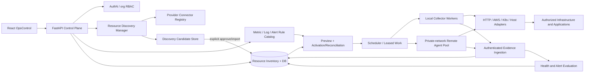
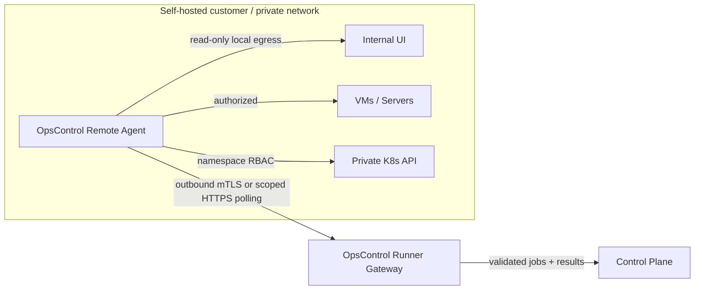

# 14 — Resource Discovery and Infrastructure Monitoring

**Status:** Phase 2 architecture specification — design approved as direction, implementation and integration verification pending. **Scope:** reusable, vendor-neutral discovery and monitoring; not tailored to any employer, customer or proprietary system.

## 1. Purpose and constraints

OpsControl should discover authorized resources and make them monitorable through **separate collectors for HTTP applications, AWS EC2, Kubernetes Pods/Deployments, and host/process/service checks**. Resource discovery and telemetry collection are **different operations**: discovery creates candidate inventory; only a deliberate authorization, rule selection and activation creates live monitoring.

The core product must work for a local independent developer with a synthetic fixture, and be extensible to networks belonging to different organizations. Provider credentials, private hostnames and production endpoints must never be required for public demos.

**Guiding principles**
- One canonical Data Source/resource inventory with typed provider attributes; optional plugins, not provider-specific core logic.
- Discovery must be read-only, bounded, explicitly authorized and reconciled rather than destructive.
- **Discovered ≠ onboarded ≠ configured ≠ active ≠ healthy.**
- **Connectivity/host/process/application health** must remain separately visible. A running EC2 or Ready Pod is not proof that the internal UI is functional.
- Metric Rules, Log Rules and Alert Rules are separate, versioned reusable catalogs. Optional templates are bundles of pinned rule versions.
- A remote network-local collector/agent uses an **outbound authenticated connection**; no need to publish internal UIs or APIs.
- Store evidence timestamps in UTC. UI world clock and timezone selection do not change scheduling or source data.

## 2. Proposed modules and boundaries



| Module | Responsibilities | Must not do |
|---|---|---|
| **Discovery Manager** | Provider accounts/clusters/networks, scheduled or one-off inventory scans, bounded pagination, normalize/deduplicate candidates, show diff/last-seen | Activate collectors without explicit policy; infer healthy from discovered |
| **Provider Connector Registry** | Versioned types and capabilities: `aws.ec2`, `kubernetes`, `host`, `http`; optional `etl` | Require one vendor to run OpsControl |
| **Resource Inventory** | Canonical identity, ownership/org/environment/labels, source mappings, discovery provenance, lifecycle and drift | Store embedded passwords/keys |
| **Rule Catalog + Activation** | Compatible rule selection, preview, pin immutable versions, reconcile generated collectors/log/metric/alert config | Treat template attachment as successful monitoring |
| **Scheduler + Collector Pools** | Lease/claim due jobs, runner availability, limits/jitter/retry, results | Arbitrarily execute user-provided commands |
| **Evidence/Health** | Ingest verified, deduped samples/events, compute target vs monitoring health and alerts, stale transitions | Report green when worker is blind |

## 3. Discovery connectors and identity

| Source | Discovery method | Canonical identity | Monitoring capabilities and caveats |
|---|---|---|---|
| HTTP/Internal Web App | Manually add FQDN/URL initially; optional approved inventory file/service catalog later | `org + normalized base URL + named application` | HTTP(S) availability/assertions; browser synthetic in later slice; URLs are never scanned speculatively |
| AWS EC2 | Read-only `DescribeInstances` by authorized account/region, optional tag filters | `AWS account ID + region + instance ID` (plus organization mapping) | CloudWatch + EC2 status; memory/disk require agent or equivalent |
| Kubernetes | Read-only list/watch with scoped permissions for authorized namespaces | `cluster ID + namespace + Kubernetes UID` | Pod phase, Ready, restarts, deployments; resource usage only if Metrics API available; watch reconnect/resync bounded |
| Host/process | Explicit agent registration or approved host inventory import; no unauthenticated network scanning | `agent identity + host ID` (org-bound) | OS CPU, RAM, disk, process/service uptime and ports depending on host agent permissions |
| Apache/Tomcat | Discover services from an explicitly registered host/process or approved HTTP endpoint | `host/resource + service name + port` | `mod_status`, optional secured JMX, service checks and application-level HTTP assertions |
| ETL/Pentaho | Independent existing ETL discovery/onboarding adapters | `configured platform + job identity` | Separate priority workstream and normalized job run model, not coupled to infra release |

**Canonical resource record** (proposed): `resource_id`, `organization_id`, `provider_type`, `external_identity`, `display_name`, `parent_id`, `environment`, `resource_type`, `labels`, `network_location_id`, `discovery_run_id`, `first_seen_at`, `last_seen_at`, `inventory_state`, `monitoring_state`. Use unique `(organization_id, provider_type, external_identity)` with provider-specific stable identity rules.

Discovery candidates have lifecycle `NEW → REVIEWED → IMPORTED/IGNORED`; imported resources can be `DISCOVERED → CONFIGURED → ACTIVATING → ACTIVE / BLOCKED / ERROR → DISABLED`. A missing cloud/Pod object becomes `MISSING` after a configurable grace window; never silently delete history or active rules. Show drift and de-duplication decisions.

## 4. Remote agent for private-network monitoring



- Install the remote agent/container/DaemonSet on an operator-controlled VM/network segment with the necessary **outbound access** to target applications, hosts or cluster API.
- Agent **initiates outbound TLS** to OpsControl using short-lived scoped service credentials; support rotation, revocation, audit and capability registration. The platform **never initiates inbound connections to private UIs**.
- Agent identity binds to **one authorized organization and runner pool**; cross-organization execution/result submission is rejected server-side.
- A runner advertises capabilities, location ID, version and heartbeat; controller dispatches only supported resource types/rules. Do not serialize secret values in dispatched jobs: use scoped secret references and protected retrieval.
- Restrict runner outbound target CIDRs/FQDNs/ports, DNS, redirect hops and protocols; **private IPs are permitted only by specifically approved local-network runner policy**. Block metadata/link-local/loopback and DNS rebinding by default. Layer with OS/network firewall, not just URL validation.
- No remote shell, arbitrary Python/JavaScript, or unsolicited auto-updates as part of generic monitoring. Browser synthetic uses isolated short-lived container and constrained declarative steps.
- On heartbeat loss: mark pool `OFFLINE`, mark pending results `STALE` and target health `UNKNOWN`; do not produce false outage incidents. Queue bounded tasks with TTL; use leases and idempotency.
- Local-only quickstart should work **without any remote agent** using an HTTP fixture; distributed mode is opt-in.

## 5. Collector contracts and health

Shared adapter interface: `discover(scope, cursor) -> candidates` (optional); `validate(config, capabilities)`; `preflight(config, approved_runner)`; `collect(context) -> typed evidence`; `capabilities()`. Adapter capabilities declare whether discovery, polling, push ingestion, logs, metrics, synthetics and secret providers are supported.

**Evidence envelope:** `schema_version, event_id, organization_id, resource_id, data_source_id, collector_id, run_id, runner_id, observed_at, received_at, rule_version_id, evidence_type, payload`. Deduplicate by stable `event_id` and run identity, validate org/source relationship and prohibit replayed revisions.

**Health dimensions:**
- **Resource:** RUNNING/STOPPED/UNKNOWN (cloud VM lifecycle, Pod phase etc.).
- **Connectivity:** UP/DOWN/UNKNOWN (from defined vantage).
- **Service/process:** RUNNING/FAILED/UNKNOWN (host agent or service check).
- **Application:** HEALTHY/WARNING/CRITICAL/UNKNOWN (HTTP assertion or browser journey).
- **Monitoring freshness:** OK/STALE/ERROR/UNSUPPORTED; separate from target health.

Use per-source alert rules for threshold, window, hysteresis, missing-data treatment, maintenance and cooldown. E.g. a Kubernetes Pod in CrashLoopBackOff is CRITICAL under the Pod rule; an EC2 instance with failed status checks is CRITICAL under EC2 rule; an HTTP 200 with a failed dashboard assertion is application CRITICAL; a disconnected runner yields UNKNOWN, **not** target CRITICAL.

Collector intervals should be independent of the homepage **5-second refresh**. Suggested HTTP probe 60 s; browser synthetic 300 s; API poll intervals adjusted for provider rate limits and monitoring policy. Store all times UTC.

## 6. Proposed discovery API contracts

All proposed routes require authenticated, server-scoped organization permissions and resource-level authorization. Neither query parameters nor submitted IDs grant access. Errors use `{code,message,request_id,details?}` with redaction. Base path `/api/v1`.

| Method | Endpoint | Semantics |
|---|---|---|
| GET | `/discovery/connectors` | List installed connector types, capability/feature readiness, required configuration schema |
| POST | `/discovery/sources` | Create approved source configuration (account/cluster/agent/manual; `credential_ref` only) |
| GET | `/discovery/sources` | Scoped source list, last run, health, permission warnings |
| POST | `/discovery/sources/{id}/runs` | `202` enqueue bounded one-off scan; idempotency key required |
| GET | `/discovery/runs/{run_id}` | Status, cursor/page progress, counts, warnings and masked errors |
| GET | `/discovery/runs/{run_id}/candidates` | Paginated new/changed/missing candidates, human-readable diff |
| POST | `/discovery/candidates/import` | Authorized batch approve/import with dry-run option, idempotency and per-item status |
| GET | `/resources` | Authorized, paginated inventory filters (org, provider, type, environment, monitoring status) |
| GET | `/resources/{id}` | Discovery provenance, capabilities, child resources, config and evidence links |
| POST | `/runner-pools` | Admin-only pool registration policy; returns no long-lived secret |
| GET | `/runner-pools` | Scoped, heartbeat/capability/status summary |
| POST | `/data-sources/{id}/activation-preview` | Reuse canonical activation preview; discovery **does not** activate automatically |

**Consistency note:** The canonical preview route remains `POST /api/v1/data-sources/{id}/activation-preview` from [05-API-CONTRACTS.md](05-API-CONTRACTS.md). All new flows must use it; do not introduce a competing GET endpoint.

**Sample candidate** (fictional):
```json
{
  "candidate_id": "8e52f65d-1e15-4a04-b462-438c03d36dc9",
  "organization_id": "<authorized-org-id>",
  "provider_type": "aws.ec2",
  "external_identity": "aws:123456789012:eu-west-1:i-0123456789abcdef0",
  "display_name": "demo-web-01",
  "resource_type": "VM",
  "labels": {"environment": "demo"},
  "discovered_at": "2026-10-10T12:00:00Z",
  "status": "NEW",
  "monitoring_status": "NOT_CONFIGURED"
}
```
A `202` discovery-run acknowledgment means **scan queued**, not candidates found; `201` approved import means **inventory created**, not monitoring enabled. For source/probe monitoring API contracts see [13-INTERNAL-APPLICATION-UI-MONITORING.md](13-INTERNAL-APPLICATION-UI-MONITORING.md).

## 7. Phased delivery (agreed sequence)

**Prerequisite P0:** Authentication + organization authorization, credential references, runner/egress policy, versioned rule-binding and idempotent activation. The known authorization defect blocks public deployment.

| Order | Workstream | Vertical-slice milestone | Evidence required |
|---|---|---|---|
| 1 | **HTTP / Application Health** | Manual endpoint registration; protected local/remote HTTP collector; status/JSON assertion, latency, freshness, independent rules + alerts | Demo fixture: HTTP 200 ready / 200 incorrect / 503 / timeout; health transitions and scoped API |
| 2 | **AWS EC2** | Read-only account/region discovery, import candidates, CloudWatch + instance checks, tag filtering | Mocked AWS client and opt-in sandbox account, IAM-denied and pagination/region tests |
| 3 | **Kubernetes Pods/Deployments** | Namespace-scoped discovery/list/watch, Pod restarts/readiness, deployment availability, optional Metrics API | Disposable cluster fixture or fake API, denied namespace, watch reconnect, Pod deletion/drift |
| 4 | **Apache/Tomcat deep monitoring** | Host/process agent capability, HTTP + optional secured mod_status/JMX, service metrics/log rules | Test containers, process/service failure, credential redaction, combined app/host views |

**Parallel, independently prioritized:** Pentaho and general **ETL job monitoring** with read-only discovery and execution normalization, preserving `NO_RUN` vs `NO_RESPONSE` vs `FAILED`. This should not be blocked by EC2/Kubernetes rollout and should never be hardwired into infrastructure collector interfaces.

**Later increments:** browser synthetic journeys, scheduled rescans/drift reconciliation, Linux/Windows deeper host telemetry, multi-vantage quorum, service maps, advanced tracing and integrations. Support incremental launch with explicit adapter capability labels and per-provider test gates.

## 8. Acceptance tests and release gates

| ID | Test | Acceptance |
|---|---|---|
| DISC-001 | Synthetic onboarding | New user runs local quickstart and observes a fictional HTTP source without AWS/K8s access. |
| DISC-002 | Scoped discovery | Anonymous denied; org A cannot run or read org B scan/candidates/import even with UUID; admin capabilities enforced. |
| DISC-003 | Idempotence | Rescan same EC2 instance/Pod UID updates last-seen and metadata without duplicate inventory or collectors. |
| DISC-004 | Deletion/drift | Missing resource shown MISSING after grace; historical evidence and rule bindings preserved, not silently deleted. |
| DISC-005 | Private network | Remote agent inside isolated subnet reaches private fixture; central OpsControl has no direct network route; result arrives securely over outbound channel. |
| DISC-006 | Runner identity | Revoked/other-org runner cannot retrieve jobs or submit fabricated evidence. Secrets do not appear in dispatcher payload/logs. |
| DISC-007 | SSRF/TLS | Block metadata/link-local, unapproved CIDR, DNS rebind, cross-host redirects and TLS invalid cert. Explicit allowlist permits authorized internal host. |
| DISC-008 | Separate health | Host running + app 503 = host HEALTHY/app CRITICAL; disconnected runner = monitoring ERROR/app UNKNOWN. |
| DISC-009 | Rule activation | Bind independent Metric/Log/Alert Rule versions or template bundle; preview; activate once; repeated request produces no duplicate collector/sample. |
| DISC-010 | Provider failures | AWS rate-limit/denied region, K8s RBAC-denied namespace and optional Metrics API absent produce actionable UNSUPPORTED/ERROR states. |
| DISC-011 | Performance | Bounded scan pagination, TTL, per-tenant caps and worker concurrency; 5-second UI refresh does not cause 5-second rescans. |
| DISC-012 | End-to-end | Approved candidate → imported resource → activated rule/collector → evidence → health/alert → correct organization-scoped KPI/list drilldown. |
| DISC-013 | ETL independence | ETL adapter can be developed/tested and scheduled without deploying EC2 or K8s modules. |
| DISC-014 | Public safety | Examples contain only fictitious data, no organization-specific hostnames, private screenshots or copied configurations. |

**Not implemented yet:** Resource Discovery Manager, EC2/K8s/host discovery, remote-agent dispatch, user-facing discovery APIs and applicable tests. This document is the implementation contract and does not certify those capabilities.
